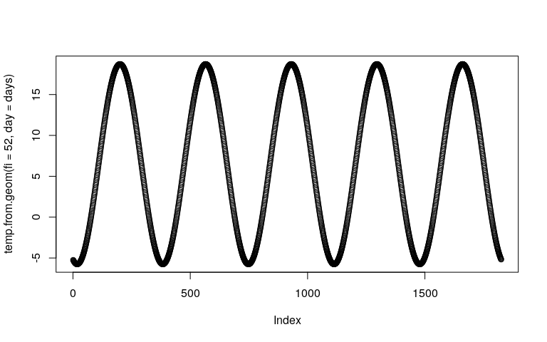
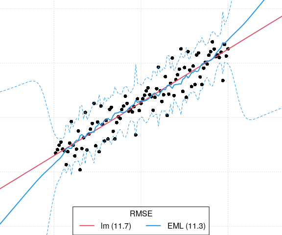
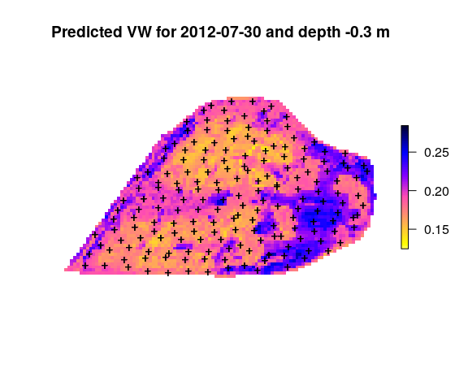

Modeling with spatial and spatiatemporal data in R / Spatiotemporal
Ensemble ML in R
================
Created and maintained by: Tom Hengl (<tom.hengl@OpenGeoHub.org>) \|
Leandro L. Parente (<leandro.parente@OpenGeoHub.org>) \| Carmelo
Bonannella (<carmelo.bonannella@OpenGeoHub.org>)
Last compiled on: 01 September, 2021


-   [ Introduction to
    spatiotemporal data](#alt-text-introduction-to-spatiotemporal-data)
    -   [Spatiotemporal data](#spatiotemporal-data)
    -   [Time-series analysis](#time-series-analysis)
    -   [Visualizing spatiotemporal
        data](#visualizing-spatiotemporal-data)
    -   [Spatiotemporal interpolation](#spatiotemporal-interpolation)
    -   [Modeling seasonal components](#modeling-seasonal-components)
-   [Modeling with spatial and spatiatemporal data in
    R](#modeling-with-spatial-and-spatiatemporal-data-in-r)
    -   [Standard ML steps](#standard-ml-steps)
    -   [Extrapolation and over-fitting
        problems](#extrapolation-and-over-fitting-problems)
    -   [Example: Spatial interpolation using ML and geographical
        distances](#example-spatial-interpolation-using-ml-and-geographical-distances)
-   [Spatiotemporal Ensemble ML in R](#spatiotemporal-ensemble-ml-in-r)
    -   [Ensemble ML](#ensemble-ml)
    -   [Ensemble ML in R](#ensemble-ml-in-r)
    -   [Example: Cookfarm dataset](#example-cookfarm-dataset)
    -   [Example: Spatiotemporal distribution of Fagus
        sylvatica](#example-spatiotemporal-distribution-of-fagus-sylvatica)
-   [Summary notes](#summary-notes)
-   [References](#references)

[](https://opengeohub.org)

[](http://creativecommons.org/licenses/by-sa/4.0/)

This work is licensed under a [Creative Commons Attribution-ShareAlike
4.0 International
License](http://creativecommons.org/licenses/by-sa/4.0/).

##  Introduction to spatiotemporal data

#### Spatiotemporal data

Spatiotemporal data indicates that the data is references in both space
and time:

-   geographic location (longitude and latitude or projected *X*, *Y*
    coordinates);
-   height above the ground surface (elevation);
-   start and end time of measurement (year, month, day, hour, minute
    etc.);

Consider for example daily temperature measured at some meteorological
station. This would have the following coordinates:

Analysis of spatiotemporal data is somewhat different from pure spatial
analysis. Time is not only 3rd dimension i.e. it has specific

For ERWIG et al. (1999) spatio-temporal data sets and corresponding
databases can be matched with the two major groups of features: (1)
**moving or dynamic objects** (discrete or vector geometries), and (2)
**regions** (fields or continuous features). Distinct objects (entities)
such as people, animals, vehicles and similar are best represented using
vectors and trajectories (movement through time), and fields can be
represented using gridded structures. In the case of working with
fields, we basically map either:

-   quantity or density of some material or chemical element,
-   energy flux or any similar physical measurements,
-   probability of occurrence of some feature or object,

Spatiotemporal data can be best visualize using space-time cubes. One
example of a spacetime cube is the following plot \[@hengl2012spatio\]:


*Figure: Space-time cube visualized in R: (a) cloud plot showing
location of meteorological stations in Croatia, (b) illustration of
spatial and temporal support in the space-time cube
\[@hengl2012spatio\].*

This shows distribution of meteorological stations over Croatia, and
then repeated measurements through time. The spatial and temporal
support are the sizes of the blocks of space and time to which
measurements apply.

#### Time-series analysis

How variables changes through time can often be drastically different
from the spatial patterns. In general one can say that, for many
environmental variables, variation of values can be separated into
**components** such as:

-   Long-term component determined by long-term geological and
    extraterrestrial processes,
-   Seasonal and daily component determined by Earth rotation and
    incoming sun radiation,
-   *Variation* component which can be due to chaotic behavior and/or
    local factors (hence *autocorrelated*), and
-   Pure noise (measurement errors and similar),

For example, in the case of the land surface temperature, the long-term
component is determined by variations in Earth’s orbit and/or Sun’s
energy output resulting in gradual drops and rises of global mean
temperature ([glacials and
interglacials](https://en.wikipedia.org/wiki/Ice_age)):


*Figure: Global temperature reconstruction from proxy data of
@Marcott1198. This shows how global temperature varies on long-term
term. Graph by: Klaus Bitterman.*

Seasonal and daily components of variation of land surface temperature
are basically determined by Earth’s rotation and angles of Sun. This is
a relatively deterministic part of variation as Earth’s rotation is
relatively stable hence the patterns produced are distinct (periodic
sinusoidal curves or similar). The plot below shows variation of values
of soil moisture and soil temperature at one meteo station in USA
\[@gasch2015spatio\]:


*Figure: Sensor values from five depths (0.3, 0.6, 0.9, 1.2, and 1.5 m)
at one station at Cook Agronomy Farm from January 2011–January 2014. The
black line indicates locally fitted splines \[@gasch2015spatio\].*

As we will see later, the seasonal part of variation can be modeling
using latitude, altitude and time/day of the year.

Field of statistics dealing with modeling changes of variables through
time, including predicting values beyond the training data (forecasting)
is known as **time-series analysis**. Some systematic guides on how to
run time-series analysis in R can be found
[here](http://r-statistics.co/Time-Series-Analysis-With-R.html).

#### Visualizing spatiotemporal data

Spatial data is usually visualized using static or interactive maps (see
e.g. [mapview](https://r-spatial.github.io/mapview/) and/or [tmap
package](https://cran.r-project.org/web/packages/tmap/vignettes/tmap-getstarted.html)).
Spatiotemporal data (2D+T) is more complex to visualize, while 3D+T data
can even require some expertise in the field \[@hengl2015plotkml\]
before user can make any seamless interpretation.

There are three possible groups of ways to visualize spatiotemporal
data:

1.  Using **static images** showing trend parameters together with
    time-series plots at selected representative point locations.  
2.  Using **time-slices** or series of visualizations of the same
    spatial domain but changing in time.  
3.  Using **animations** or **interactive plots with time-sliders**
    allowing users to choose *speed* and *direction* of animation.

For an introduction to visualizying spatiotemporal and time-series data
is @lamigueiro2014displaying. More complex visualization of
spatiotemporal / dynamic features is possible by using the
<https://geemap.org/> package (*A Python package for interactive mapping
with Google Earth Engine, ipyleaflet, and ipywidgets*). OpenLandMap.org
has multiple temporal datasets and users can interactive with
time-dimension by using the time-slider implemented in [OpenLayers +
Geoserver](http://osgl.grf.bg.ac.rs/books/gvvk-en/)
\[@KilibardaProtic2019\].


*Figure: Visualization of [land cover change using
animation](https://medium.com/nerd-for-tech/restoration-culture-what-is-land-degradation-how-to-measure-it-and-what-can-you-do-to-reverse-341e448994da)
in www.OpenLandMap.org.*

#### Spatiotemporal interpolation

Spatiotemporal interpolation and/or prediction implies that point
samples are used to interpolate within the spacetime cube. This
obviously assumes that enough point measurements are available spread in
both space and time. Spatiotemporal interpolation using various kriging
methods is implemented in the [gstat
package](https://cran.r-project.org/web/packages/gstat/vignettes/spatio-temporal-kriging.pdf).
We will show in this tutorial that Machine Learning can be used to
interpolate values within the spacetime cube. For success of
spatiotemporal interpolation, the key is to recognize systematic
component of variation in spacetime, which is usually possible if we
find relationship between the target variable and some EO data
(temporally dynamic) that is available possibly at high spatial
resolution.

For more in-depth discussion on spatitemporal data in R please refer to
@wikle2019spatio. For in-depth discussion on spatial and spatiotemporal
blocking for purpose of modeling building and cross-validation refer to
@Roberts2017.

#### Modeling seasonal components

The seasonal component of variation is determined by Earth’s rotation
and Sun’s angle. @kilibarda2014spatio have shown that the seasonal
component e.g. geometric Earth surface minimum and maximum temperature,
which can be modeled universally anywhere on globe by using the
following formula:

``` r
temp.from.geom <- function(fi, day, a=30.419375, 
                b=-15.539232, elev=0, t.grad=0.6) {
  f = ifelse(fi==0, 1e-10, fi)
  costeta = cos( (day-18 )*pi/182.5 + 2^(1-sign(fi) ) *pi) 
  cosfi = cos(fi*pi/180 )
  A = cosfi
  B = (1-costeta ) * abs(sin(fi*pi/180 ) )
  x = a*A + b*B - t.grad * elev / 100
  return(x)
}
```

where `day` is the day of year, `fi` is the latitude, the number 18
represents the coldest day in the northern and warmest day in the
southern hemisphere, `elev` is the elevation in meter, 0.6 is the
vertical temperature gradient per 100\~m, and `sign` denotes the
*signum* function that extracts the sign of a real number.

A simple example of min temperature is:

``` r
temp.from.geom(fi=52, day=120)
```

    ## [1] 8.73603

If we plot this function for 5 years we get something looking like the
spline-fitted functions in the previous plot:

``` r
days = seq(1:(5*365))
plot(temp.from.geom(fi=52, day=days))
```

<div class="figure">


<p class="caption">
Geometric temperature function plot.
</p>

</div>

In principle, this geometric or seasonal component is inexpensive to
compute and can be added universally to any spatiotemporal model.

## Modeling with spatial and spatiatemporal data in R

#### Standard ML steps

Standard spatiotemporal ML includes the following steps:

1.  Prepare training (points) data and data cube with all covariates
    referenced in spacetime.  
2.  Overlay points in spacetime, create a spatiotemporal
    regression-matrix.  
3.  Add seasonal components, fine-tune initial model, reduce complexity
    and produce production-ready spatiotemporal prediction model.  
4.  Run mapping accuracy assessment and determine prediction uncertainty
    including the per pixel uncertainty.  
5.  Generate predictions in spacetime — create time-series of
    predictions.  
6.  Run change-detection / trend analysis and try to detect main drivers
    of positive / negative trends.  
7.  Deploy predictions as Cloud-Optimized GeoTIFF and produce the final
    report with mapping accuracy, variable importance.

#### Extrapolation and over-fitting problems

Machine Learning techniques such as Random Forest have proven to
over-perform vs more simple linear statistical methods, especially where
the datasets are large, complex and target variable follow complex
relationship with covariates. Random Forest comes at cost, there are
four main disadvantages of RF:

-   Depending on data and assumptions about data, it can over-fit values
    without an analyst noticing it.  
-   It predicts well only within the feature space with enough training
    data. Extrapolation i.e. prediction outside the training space can
    lead to poor performance.  
-   It can be computationally expensive, computational load increasing
    exponentially with the number of covariates.  
-   It requires quality training data and is sensitive to blunders and
    typos in the data.

Read more about extrapolation problems in [this
post](https://medium.com/nerd-for-tech/extrapolation-is-tough-for-trees-tree-based-learners-combining-learners-of-different-type-makes-659187a6f58d).

In the following section we will demonstrate that indeed RF overfits
data and can have serious problems with predicting in the extrapolation
space. Consider for example the following synthetic data set (see
[original post by Dylan
Beaudette](https://twitter.com/DylanBeaudette/status/1410666900581851138)):

``` r
set.seed(200)
n = 100
x <- 1:n
y <- x + rnorm(n = 50, mean = 15, sd = 15)
```

If we fit a simple Ordinary Least Square model to this data we get:

``` r
m0 <- lm(y ~ x)
summary(m0)
```

    ## 
    ## Call:
    ## lm(formula = y ~ x)
    ## 
    ## Residuals:
    ##      Min       1Q   Median       3Q      Max 
    ## -27.6093  -6.4396   0.6437   6.7742  26.7192 
    ## 
    ## Coefficients:
    ##             Estimate Std. Error t value Pr(>|t|)    
    ## (Intercept) 14.84655    2.37953   6.239 1.12e-08 ***
    ## x            0.97910    0.04091  23.934  < 2e-16 ***
    ## ---
    ## Signif. codes:  0 '***' 0.001 '**' 0.01 '*' 0.05 '.' 0.1 ' ' 1
    ## 
    ## Residual standard error: 11.81 on 98 degrees of freedom
    ## Multiple R-squared:  0.8539, Adjusted R-squared:  0.8524 
    ## F-statistic: 572.9 on 1 and 98 DF,  p-value: < 2.2e-16

we see that the model explains about 85% of variation in the data and
that the RMSE estimated by the model (residual standard error) matches
very well the noise component we have inserted on purpose using the
`rnorm` function. If we fit a Random Forest model to this data we get:

``` r
library(randomForest)
rf = randomForest::randomForest(data.frame(x=x), y, nodesize = 5, keep.inbag = TRUE)
rf
```

    ## 
    ## Call:
    ##  randomForest(x = data.frame(x = x), y = y, nodesize = 5, keep.inbag = TRUE) 
    ##                Type of random forest: regression
    ##                      Number of trees: 500
    ## No. of variables tried at each split: 1
    ## 
    ##           Mean of squared residuals: 202.6445
    ##                     % Var explained: 78.34

Next, we can estimate the prediction errors using the method of
@lu2021unified, which is available via the `forestError` package:

``` r
library(forestError)
rmse <- function(a, b) {  sqrt(mean((a - b)^2)) }
dat <- data.frame(x,y)
newdata <- data.frame(
  x = -100:200
)
newdata$y.lm <- predict(m0, newdata = newdata)
## prediction error from forestError:
quantiles = c((1-.682)/2, 1-(1-.682)/2)
pr.rf = quantForestError(rf, X.train=data.frame(x=x), X.test=data.frame(x = -100:200), Y.train=y, alpha = (1-(quantiles[2]-quantiles[1])))
newdata$y.rf <- predict(rf, newdata = newdata)
rmse.lm <- round(rmse(y, predict(m0)), 1)
rmse.rf <- round(rmse(y, predict(rf)), 1)
rmse.lm; rmse.rf
```

    ## [1] 11.7

    ## [1] 14.2

This shows that RF estimates higher RMSE than linear model. However, if
we visualize the two models against each other we see that indeed RF
model seems to over-fit the data:

``` r
leg.txt <- sprintf("%s (%s)", c('lm', 'RF'), c(rmse.lm, rmse.rf))
par(mar = c(0, 0, 0, 0), fg = 'black', bg = 'white')
plot(y ~ x, xlim = c(-25, 125), ylim = c(-50, 150), type = 'n', axes = FALSE)
grid()
points(y ~ x, cex = 1, pch = 16, las = 1)
lines(y.lm ~ x, data = newdata, col = 2, lwd = 2)
lines(y.rf ~ x, data = newdata, col = 4, lwd = 2)
lines(newdata$x, pr.rf$estimates$lower_0.318, lty=2,col=4)
lines(newdata$x, pr.rf$estimates$upper_0.318, lty=2,col=4)
legend('bottom', legend = leg.txt, lwd = 2, lty = 1, col = c(2, 4, 3), horiz = TRUE, title = 'RMSE')
```

<div class="figure">


<p class="caption">
Difference in model fits for sythetic data: lm vs RF.
</p>

</div>

We can notice that RF basically tries to fit relationship even to the
component of variation which is pure noise (we know this because we have
generated it using the `rnorm` function). This is obvious over-fitting
as we do not want to model something which is purely random.

Extrapolation would not maybe be so much of a problem in the example
above if the prediction intervals from the `forestError` package
expressed more realistically that the predictions deviate from the
*linear structure* in the data. Assuming that, after the prediction, one
would eventually collect ground-truth data for the RF model above, these
would probably show that the prediction error / prediction intervals are
completely off. Most traditional statisticians would consider these
too-narrow and over-optimistic and the fitted line over-fit, and hence
any further down the pipeline over-optimistic prediction uncertainty can
result in decision makers being over-confident, leading to wrong
decisions, and consequently making users losing any confidence in RF.
For an in-depth discussion on extrapolation problems and *Area of
Applicability* of Machine Learning models please refer to
@meyerPebesma2020.

A possible solution to the problem above is to, instead of using only
one learners, we use multiple learners and then apply robust
cross-validation that prevents the target model from over-fitting. This
can be implemented efficiently by using the `mlr` package for example
@bischl2016mlr. We can run an Ensemble Model by applying the following
four steps. First, we define the task of interest and a combination of
learners:

``` r
library(mlr)
library(kernlab)
library(mboost)
library(landmap)
SL.library = c("regr.ranger", "regr.glm", "regr.gamboost", "regr.ksvm")
lrns <- lapply(SL.library, mlr::makeLearner)
tsk <- mlr::makeRegrTask(data = dat, target = "y")
```

In this case we use basically four very different models: RF (`ranger`),
linear model (`glm`), Gradient boosting (`gamboost`) and Support Vector
Machine (`kvsm`).

Second, we train the Ensemble model by using the stacking approach:

``` r
init.m <- mlr::makeStackedLearner(lrns, method = "stack.cv", super.learner = "regr.lm", resampling=mlr::makeResampleDesc(method = "CV"))
eml = train(init.m, tsk)
```

    ## Warning in bsplines(mf[[i]], knots = args$knots[[i]]$knots, boundary.knots = args$knots[[i]]$boundary.knots, : Some 'x' values are
    ## beyond 'boundary.knots'; Linear extrapolation used.

    ## Warning in bsplines(mf[[i]], knots = args$knots[[i]]$knots, boundary.knots = args$knots[[i]]$boundary.knots, : Some 'x' values are
    ## beyond 'boundary.knots'; Linear extrapolation used.

``` r
summary(eml$learner.model$super.model$learner.model)
```

    ## 
    ## Call:
    ## stats::lm(formula = f, data = d)
    ## 
    ## Residuals:
    ##      Min       1Q   Median       3Q      Max 
    ## -28.0474  -7.0473  -0.4075   7.2528  28.6083 
    ## 
    ## Coefficients:
    ##               Estimate Std. Error t value Pr(>|t|)    
    ## (Intercept)   -0.86179    3.01456  -0.286  0.77560    
    ## regr.ranger   -0.27294    0.24292  -1.124  0.26402    
    ## regr.glm       4.75714    1.09051   4.362 3.27e-05 ***
    ## regr.gamboost -3.55134    1.14764  -3.094  0.00259 ** 
    ## regr.ksvm      0.08578    0.28482   0.301  0.76394    
    ## ---
    ## Signif. codes:  0 '***' 0.001 '**' 0.01 '*' 0.05 '.' 0.1 ' ' 1
    ## 
    ## Residual standard error: 11.25 on 95 degrees of freedom
    ## Multiple R-squared:  0.8714, Adjusted R-squared:  0.8659 
    ## F-statistic: 160.9 on 4 and 95 DF,  p-value: < 2.2e-16

This shows that `ranger` and `ksvm` basically under-perform and are in
fact not significant for this specific data i.e. could be omitted from
modeling.

Note that, for *stacking* of multiple learners we use a `super.learner`
(meta-learner) which is in this case a simple linear model. We use a
simple model because we assume that the non-linear relationships have
already been modeled via complex models such as `ranger`, `gamboost`
and/or `ksvm`.

Next we need to estimate mapping accuracy and prediction errors for
Ensemble predictions. This is not trivial, as it requires a
non-parametric approach. A computationally interesting approach is to
first estimate global mapping accuracy, then adjust the prediction
variance derived simply as a standard deviation of learners:

``` r
newdata$y.eml = predict(eml, newdata = newdata)$data$response
```

    ## Warning in bsplines(mf[[i]], knots = args$knots[[i]]$knots, boundary.knots = args$knots[[i]]$boundary.knots, : Some 'x' values are
    ## beyond 'boundary.knots'; Linear extrapolation used.

``` r
m.train = eml$learner.model$super.model$learner.model$model
m.terms = eml$learner.model$super.model$learner.model$terms
eml.MSE0 = matrixStats::rowSds(as.matrix(m.train[,all.vars(m.terms)[-1]]), na.rm=TRUE)^2
eml.MSE = deviance(eml$learner.model$super.model$learner.model)/df.residual(eml$learner.model$super.model$learner.model)
## correction factor / mass-preservation of MSE
eml.cf = eml.MSE/mean(eml.MSE0, na.rm = TRUE)
eml.cf
```

    ## [1] 9.328646

This shows that variance of the learners is about 10 times smaller than
the actual CV variance. Again, this proves that many learners try to fit
data very closely so that variance of different learners can be somewhat
smoothed out.

Next, we can predict values and prediction errors at all new locations:

``` r
pred = mlr::getStackedBaseLearnerPredictions(eml, newdata=data.frame(x = -100:200))
```

    ## Warning in bsplines(mf[[i]], knots = args$knots[[i]]$knots, boundary.knots = args$knots[[i]]$boundary.knots, : Some 'x' values are
    ## beyond 'boundary.knots'; Linear extrapolation used.

``` r
rf.sd = sqrt(matrixStats::rowSds(as.matrix(as.data.frame(pred)), na.rm=TRUE)^2 * eml.cf)
rmse.eml <- round(sqrt(eml.MSE), 1)
```

and the plot the results of fitting linear model vs EML:

``` r
leg.txt <- sprintf("%s (%s)", c('lm', 'EML'), c(rmse.lm, rmse.eml))
par(mar = c(0, 0, 0, 0), fg = 'black', bg = 'white')
plot(y ~ x, xlim = c(-25, 125), ylim = c(-50, 150), type = 'n', axes = FALSE)
grid()
points(y ~ x, cex = 1, pch = 16, las = 1)
lines(y.lm ~ x, data = newdata, col = 2, lwd = 2)
lines(y.eml ~ x, data = newdata, col = 4, lwd = 2)
lines(newdata$x, newdata$y.eml+rmse.eml+rf.sd, lty=2, col=4)
lines(newdata$x, newdata$y.eml-(rmse.eml+rf.sd), lty=2, col=4)
legend('bottom', legend = leg.txt, lwd = 2, lty = 1, col = c(2, 4, 3), horiz = TRUE, title = 'RMSE')
```

<div class="figure">


<p class="caption">
Difference in model fits for sythetic data: lm vs Ensemble ML.
</p>

</div>

Note that from the plot above, prediction error intervals in the
extrapolation space can be quite wide, and this reflects much better
what we would expect.

In summary: it appears that combining linear and non-linear tree-based
models both helps decrease over-fitting and produce realistic
predictions of uncertainty / prediction intervals. The Ensemble ML
framework correctly identifies linear models as being more important
than random forest or similar.

#### Example: Spatial interpolation using ML and geographical distances

One simple approach to interpolate values from point data using e.g.
Random Forest is to use buffer distances to all points as covariates. We
use the meuse dataset for testing:

``` r
library(rgdal)
library(ranger)
library(raster)
library(plotKML)
demo(meuse, echo=FALSE)
grid.dist0 <- landmap::buffer.dist(meuse["zinc"], meuse.grid[1], as.factor(1:nrow(meuse)))
```

This creates 155 gridded maps i.e. one map per point. These maps can now
be used to predict some target variable e.g.:

``` r
dn0 <- paste(names(grid.dist0), collapse="+")
fm0 <- as.formula(paste("zinc ~ ", dn0))
ov.zinc <- over(meuse["zinc"], grid.dist0)
rm.zinc <- cbind(meuse@data["zinc"], ov.zinc)
m.zinc <- ranger(fm0, rm.zinc, num.trees=150, seed=1)
m.zinc
```

    ## Ranger result
    ## 
    ## Call:
    ##  ranger(fm0, rm.zinc, num.trees = 150, seed = 1) 
    ## 
    ## Type:                             Regression 
    ## Number of trees:                  150 
    ## Sample size:                      155 
    ## Number of independent variables:  155 
    ## Mtry:                             12 
    ## Target node size:                 5 
    ## Variable importance mode:         none 
    ## Splitrule:                        variance 
    ## OOB prediction error (MSE):       67501.48 
    ## R squared (OOB):                  0.4990359

Using this model we can generate and plot predictions using:

``` r
zinc.rfd <- predict(m.zinc, grid.dist0@data)$predictions
meuse.grid$zinc.rfd = zinc.rfd
plot(raster(meuse.grid["zinc.rfd"]), col=R_pal[["rainbow_75"]][4:20],
         main="Predictions RF on buffer distances", axes=FALSE, box=FALSE)
points(meuse, pch="+")
```

<div class="figure">


<p class="caption">
Values of Zinc predicted using only RF on buffer distances.
</p>

</div>

This method is obviously not suitable for very large point datasets.
@sekulic2020random describe an alternative, more scalable method that
uses closest neighbors (and their values) as covariates to predict
target variable. This can be implemented using the `meteo` package:

``` r
library(meteo)
nearest_obs <- meteo::near.obs(locations = meuse.grid, 
                               locations.x.y = c("x","y"), 
                               observations = meuse, observations.x.y=c("x","y"), 
                               zcol = "zinc", n.obs = 10, rm.dupl = TRUE)
```

    ## Warning in if (class(knn1$nn.idx) != "integer") {: the condition has length > 1 and only the first element will be used

``` r
str(nearest_obs)
```

    ## 'data.frame':    3103 obs. of  20 variables:
    ##  $ dist1 : num  168.2 112 139.9 172 56.4 ...
    ##  $ dist2 : num  204 165 164 173 127 ...
    ##  $ dist3 : num  239 183 210 230 139 ...
    ##  $ dist4 : num  282 268 246 241 265 ...
    ##  $ dist5 : num  370 331 330 335 297 ...
    ##  $ dist6 : num  407 355 370 380 306 ...
    ##  $ dist7 : num  429 406 391 388 390 ...
    ##  $ dist8 : num  504 448 473 472 393 ...
    ##  $ dist9 : num  523 476 484 496 429 ...
    ##  $ dist10: num  524 480 488 497 431 ...
    ##  $ obs1  : num  1022 1022 1022 640 1022 ...
    ##  $ obs2  : num  640 640 640 1022 1141 ...
    ##  $ obs3  : num  1141 1141 1141 257 640 ...
    ##  $ obs4  : num  257 257 257 1141 257 ...
    ##  $ obs5  : num  346 346 346 346 346 346 346 346 346 346 ...
    ##  $ obs6  : num  406 406 406 269 406 406 406 269 257 406 ...
    ##  $ obs7  : num  269 269 269 406 269 ...
    ##  $ obs8  : num  1096 1096 1096 281 1096 ...
    ##  $ obs9  : num  347 347 347 347 504 347 347 279 269 504 ...
    ##  $ obs10 : num  281 504 281 279 347 504 279 347 347 347 ...

which produces 20 grids showing assigned values from 1st to 10th
neighbor and distances. We can plot values based on the first neighbor,
which corresponds to using e.g. [Voronoi
polygons](https://r-spatial.github.io/sf/reference/geos_unary.html):

``` r
meuse.gridF = meuse.grid
meuse.gridF@data = nearest_obs
spplot(meuse.gridF[11])
```

<div class="figure">


<p class="caption">
Values of first neighbor for meuse dataset.
</p>

</div>

Next, we can estimate the same values for training points, but this time
we remove any duplicates using `rm.dupl = TRUE`:

``` r
## training points
nearest_obs.dev <- meteo::near.obs(locations = meuse, 
                                   locations.x.y = c("x","y"), 
                                   observations = meuse, 
                                   observations.x.y=c("x","y"), 
                                   zcol = "zinc", n.obs = 10, rm.dupl = TRUE)
```

    ## Warning in if (class(knn1$nn.idx) != "integer") {: the condition has length > 1 and only the first element will be used

``` r
meuse@data <- cbind(meuse@data, nearest_obs.dev)
```

Finally, we can fit a model to predict values purely based on spatial
autocorrelation between values:

``` r
fm.RFSI <- as.formula(paste("zinc ~ ", paste(paste0("dist", 1:10), collapse="+"), "+", paste(paste0("obs", 1:10), collapse="+")))
fm.RFSI
```

    ## zinc ~ dist1 + dist2 + dist3 + dist4 + dist5 + dist6 + dist7 + 
    ##     dist8 + dist9 + dist10 + obs1 + obs2 + obs3 + obs4 + obs5 + 
    ##     obs6 + obs7 + obs8 + obs9 + obs10

``` r
rf_RFSI <- ranger(fm.RFSI, data=meuse@data, importance = "impurity", num.trees = 85, keep.inbag = TRUE)
rf_RFSI
```

    ## Ranger result
    ## 
    ## Call:
    ##  ranger(fm.RFSI, data = meuse@data, importance = "impurity", num.trees = 85,      keep.inbag = TRUE) 
    ## 
    ## Type:                             Regression 
    ## Number of trees:                  85 
    ## Sample size:                      155 
    ## Number of independent variables:  20 
    ## Mtry:                             4 
    ## Target node size:                 5 
    ## Variable importance mode:         impurity 
    ## Splitrule:                        variance 
    ## OOB prediction error (MSE):       72615.86 
    ## R squared (OOB):                  0.4610795

To produce predictions we can run:

``` r
out = predict(rf_RFSI, meuse.gridF@data)
meuse.grid$zinc.rfsi = out$predictions
plot(raster(meuse.grid["zinc.rfsi"]), col=R_pal[["rainbow_75"]][4:20],
     main="Predictions RFSI", axes=FALSE, box=FALSE)
points(meuse, pch="+")
```

<div class="figure">


<p class="caption">
Values of first neighbor for meuse dataset.
</p>

</div>

``` r
#dev.off()
```

Predictions using nearest neighbors shows quite different patterns than
predictions based on buffer distances. The method by @sekulic2020random
is nevertheless more interest for general applications as it could be
also added to spatiotemporal data problems.

## Spatiotemporal Ensemble ML in R

#### Ensemble ML

Ensemble Machine Learning is discussed in detail in [this R
tutorial](https://gitlab.com/openlandmap/spatial-predictions-using-eml).

#### Ensemble ML in R

#### Example: Cookfarm dataset

In previous examples we have demonstrated effects of over-fitting and
how Ensemble ML helps decrease overfitting and extrapolation problems
using synthetic data. We can now look at some real-life cases, for
example the **Cookfarm dataset**, which is available via the landmap
package:

``` r
library(landmap)
#?landmap::cookfarm
data("cookfarm")
```

This dataset contains spatio-temporal (3D+T) measurements of three soil
properties and a number of spatial and temporal regression covariates.
It is described in detail in @gasch2015spatio. In this example we fit a
spatiotemporal model to predict soil moisture, soil temperature and
electrical conductivity in 3D+T.

We can load the prediction locations and regression-matrix from:

``` r
library(rgdal)
library(ranger)
cookfarm.rm = readRDS('input/cookfarm_st.rds')
cookfarm.grid = readRDS('input/cookfarm_grid10m.rds')
```

We are interested in modeling soil moisture (`VW`) as a function of soil
depth (`altitude`), elevation (`DEM`), Topographic Wetness Index
(`TWI`), Normalized Difference Red Edge Index (`NDRE.M`), Normalized
Difference Red Edge Index (`NDRE.sd`), Cumulative precipitation in mm
(`Precip_cum`), Maximum measured temperature (`MaxT_wrcc`), Minimum
measured temperature (`MinT_wrcc`) and the transformed cumulative day
(`cdayt`):

``` r
fm <- VW ~ altitude+DEM+TWI+NDRE.M+NDRE.Sd+Precip_cum+MaxT_wrcc+MinT_wrcc+cdayt
```

We can use the ranger package to fit a random forest model:

``` r
m.vw = ranger(fm, cookfarm.rm, num.trees = 100)
m.vw
```

    ## Ranger result
    ## 
    ## Call:
    ##  ranger(fm, cookfarm.rm, num.trees = 100) 
    ## 
    ## Type:                             Regression 
    ## Number of trees:                  100 
    ## Sample size:                      107851 
    ## Number of independent variables:  9 
    ## Mtry:                             3 
    ## Target node size:                 5 
    ## Variable importance mode:         none 
    ## Splitrule:                        variance 
    ## OOB prediction error (MSE):       0.0009823271 
    ## R squared (OOB):                  0.8480396

which shows that a significant model can be fitting using this data with
R-square above 0.80. This model, however, as shown in @gasch2015spatio
unfortunately ignores the fact that many `VW` measurements have exactly
the same location, hence it over-fitts data and gives unrealistic
R-square.

We can now fit an Ensemble ML model, but we will also use a **blocking
parameter** that should protect from over-fitting: the unique code of
the station (`SOURCEID`). This means that complete stations will be
either used for training or for validation. This satisfies the
requirement of @Roberts2017 to predicting to new data or predictor
space.

We use the same procedure in `mlr` as in the previous example:

``` r
library(mlr)
SL.lst = c("regr.ranger", "regr.gamboost", "regr.cvglmnet")
lrns.st <- lapply(SL.lst, mlr::makeLearner)
## subset to 5% to speed up computing
subs <- runif(nrow(cookfarm.rm))<.05
tsk.st <- mlr::makeRegrTask(data = cookfarm.rm[subs, all.vars(fm)], target = "VW", 
            blocking = as.factor(cookfarm.rm$SOURCEID)[subs])
tsk.st
```

    ## Supervised task: cookfarm.rm[subs, all.vars(fm)]
    ## Type: regr
    ## Target: VW
    ## Observations: 5450
    ## Features:
    ##    numerics     factors     ordered functionals 
    ##           9           0           0           0 
    ## Missings: FALSE
    ## Has weights: FALSE
    ## Has blocking: TRUE
    ## Has coordinates: FALSE

The resulting model again used simple linear regression for stacking
various learners:

    ## Starting parallelization in mode=socket with cpus=32.

    ## Exporting objects to slaves for mode socket: .mlr.slave.options

    ## Mapping in parallel: mode = socket; level = mlr.resample; cpus = 32; elements = 10.

    ## Exporting objects to slaves for mode socket: .mlr.slave.options

    ## Mapping in parallel: mode = socket; level = mlr.resample; cpus = 32; elements = 10.

    ## Exporting objects to slaves for mode socket: .mlr.slave.options

    ## Mapping in parallel: mode = socket; level = mlr.resample; cpus = 32; elements = 10.

    ## Stopped parallelization. All cleaned up.

Note that here we can use full-parallelisation to speed up computing by
using the `parallelMap` package. This resuting EML model now shows a
more realistic R-square / RMSE:

``` r
summary(eml.VW$learner.model$super.model$learner.model)
```

    ## 
    ## Call:
    ## stats::lm(formula = f, data = d)
    ## 
    ## Residuals:
    ##       Min        1Q    Median        3Q       Max 
    ## -0.181392 -0.042795  0.002389  0.044552  0.183285 
    ## 
    ## Coefficients:
    ##                Estimate Std. Error t value Pr(>|t|)    
    ## (Intercept)    0.049382   0.008555   5.772 8.25e-09 ***
    ## regr.ranger    1.105917   0.027642  40.009  < 2e-16 ***
    ## regr.gamboost -0.812244   0.070592 -11.506  < 2e-16 ***
    ## regr.cvglmnet  0.534931   0.052484  10.192  < 2e-16 ***
    ## ---
    ## Signif. codes:  0 '***' 0.001 '**' 0.01 '*' 0.05 '.' 0.1 ' ' 1
    ## 
    ## Residual standard error: 0.06103 on 5446 degrees of freedom
    ## Multiple R-squared:  0.4296, Adjusted R-squared:  0.4293 
    ## F-statistic:  1367 on 3 and 5446 DF,  p-value: < 2.2e-16

This is now a 3D+T model of `VW`, which means that we can use it to
predict values of `VW` at any new `x,y,d,t` location. To make prediction
of a specific *slice* we use:

``` r
cookfarm$weather$Precip_cum <- ave(cookfarm$weather$Precip_wrcc,
   rev(cumsum(rev(cookfarm$weather$Precip_wrcc)==0)), FUN=cumsum)
date = as.Date("2012-07-30")
cday = floor(unclass(date)/86400-.5)
cdayt = cos((cday-min(cookfarm.rm$cday))*pi/180)
depth = -0.3
new.st <- data.frame(cookfarm.grid)
new.st$Date = date
new.st$cdayt = cdayt
new.st$altitude = depth
new.st = plyr::join(new.st, cookfarm$weather, type="left")
```

    ## Joining by: Date

``` r
## predict:
pr.df = predict(eml.VW, newdata = new.st[,all.vars(fm)[-1]])
```

    ## Warning in bsplines(mf[[i]], knots = args$knots[[i]]$knots, boundary.knots = args$knots[[i]]$boundary.knots, : Some 'x' values are
    ## beyond 'boundary.knots'; Linear extrapolation used.

    ## Warning in bsplines(mf[[i]], knots = args$knots[[i]]$knots, boundary.knots = args$knots[[i]]$boundary.knots, : Some 'x' values are
    ## beyond 'boundary.knots'; Linear extrapolation used.

    ## Warning in bsplines(mf[[i]], knots = args$knots[[i]]$knots, boundary.knots = args$knots[[i]]$boundary.knots, : Some 'x' values are
    ## beyond 'boundary.knots'; Linear extrapolation used.

To plot prediction together with locations of training points we can
use:

``` r
cookfarm.grid$pr.VW = pr.df$data$response
plot(raster::raster(cookfarm.grid["pr.VW"]), col=rev(bpy.colors()),
    main="Predicted VW for 2012-07-30 and depth -0.3 m", axes=FALSE, box=FALSE)
points(cookfarm$profiles[,c("Easting","Northing")], pch="+")
```

<div class="figure">


<p class="caption">
Predicted soil water content based on spatiotemporal EML.
</p>

</div>

We could likewise predict values for longer period (e.g. 100 days) then
visualize changes using e.g. the `animation` package.

#### Example: Spatiotemporal distribution of Fagus sylvatica

In the next example we demonstrate how to fit a spatiotemporal model
using biological data: occurrences of [*Fagus
sylvatica*](https://www.gbif.org/species/2882316) over Europe. This is
the domain of Specied Distribution modeling, except in this case we
model distribution of target species in spacetime. The point data has
been compiled for the purpose of the OpenDataScience.eu project, then
cleaned and overlaid vs time-series of Landsat GLAD images and climatic
variables. For more details refer to the [eumap
repository](https://gitlab.com/geoharmonizer_inea/eumap).

We can load a snapshot of data by using:

``` r
library(data.table)
library(mlr)
library(sp)
fs.rm = readRDS('input/fagus_sylvatica_st.rds')
occ.pnts = fs.rm[,c("Atlas_class","easting","northing")]
coordinates(occ.pnts) = ~ easting + northing
proj4string(occ.pnts) = "+init=epsg:3035"
occ.pnts = spTransform(occ.pnts, CRS("+init=epsg:4326"))
```

This is a subset of a [larger
dataset](https://gitlab.com/openlandmap/eu-forest-tree-point-data) that
has been used to produce predictions of distribution of key forest tree
species for Europe (<https://maps.opendatascience.eu>). The first
columns of dataset show:

``` r
head(fs.rm[,1:10])
```

    ##          id year postprocess Tile_ID easting northing Atlas_class lc1
    ## 9   1499539 2015   spacetime    9689 3948500  2431500           1    
    ## 38   660325 2008   spacetime    8728 3318500  2283500           1    
    ## 56   660325 2002   spacetime    8728 3318500  2283500           1    
    ## 68  2044229 2006   spacetime   11017 4294500  2655500           1    
    ## 104  586994 2016   spacetime    8724 3204500  2309500           1    
    ## 111  622055 2016   spacetime    8349 3231500  2226500           1    
    ##     clm_air.temp_era5.copernicus_av_1km_200..200cm_02.01..02.28_avg_5yrs_eumap_epsg3035_v0.1.tif
    ## 9                                                                                            -35
    ## 38                                                                                             0
    ## 56                                                                                            19
    ## 68                                                                                           -35
    ## 104                                                                                           31
    ## 111                                                                                           -6
    ##     clm_air.temp_era5.copernicus_av_1km_200..200cm_02.01..02.28_mean_eumap_epsg3035_v0.1.tif
    ## 9                                                                                        -36
    ## 38                                                                                        31
    ## 56                                                                                        22
    ## 68                                                                                       -40
    ## 104                                                                                       46
    ## 111                                                                                        9

The header columns are:

-   `id`: is the unique ID of each point;  
-   `year`: is the year of obsevation;
-   `postprocess`: column can have value yearly or spacetime to identify
    if the temporal reference of an observation comes from the original
    dataset or is the result of postprocessing (yearly for originals,
    spacetime for postprocessed points);  
-   `Tile_ID`: is as extracted from the 30-km tiling system;  
-   `easting`: is the easting coordinate of the observation point;
-   `northing`: is the northing coordinate of the observation point;
-   `Atlas_class`: contains name of the tree species or NULL if it’s an
    absence point coming from LUCAS;
-   `lc1`: contains original LUCAS land cover classes or NULL if it’s a
    presence point;

Other columns are the EO and ecological covariates that we use for
modeling distribution of Fagus Sylvatica. We can plot distribution of
points over EU using:

``` r
library(rnaturalearth)
library(raster)
europe <- rnaturalearth::ne_countries(scale=10, continent = 'europe')
europe <- raster::crop(europe, extent(-24.8,35.2,31,68.5))
op = par(mar=c(0,0,0,0))
plot(europe, col="lightgrey", border="darkgrey", axes=FALSE)
points(occ.pnts[occ.pnts$Atlas_class==1,], pch="+", cex=.8)
```

<div class="figure">


<p class="caption">
Distribution of occurrence locations for Fagus Sylvatica.
</p>

</div>

``` r
par(op)
#dev.off()
```

As in previous examples, we first define the target model formula. We
need to remove from model of course all other columns that are not used
for prediction:

``` r
covs = grep("id|year|postprocess|Tile_ID|easting|northing|Atlas_class|lc1", 
          colnames(fs.rm), value = TRUE, invert = TRUE)
fm.fs = stats::as.formula(paste("Atlas_class ~ ", paste(covs, collapse="+")))
fs.rm$Atlas_class = factor(fs.rm$Atlas_class)
all.vars(fm.fs)[1:5]
```

    ## [1] "Atlas_class"                                                                                 
    ## [2] "clm_air.temp_era5.copernicus_av_1km_200..200cm_02.01..02.28_avg_5yrs_eumap_epsg3035_v0.1.tif"
    ## [3] "clm_air.temp_era5.copernicus_av_1km_200..200cm_02.01..02.28_mean_eumap_epsg3035_v0.1.tif"    
    ## [4] "clm_air.temp_era5.copernicus_av_1km_200..200cm_02.01..02.28_std_eumap_epsg3035_v0.1.tif"     
    ## [5] "clm_air.temp_era5.copernicus_av_1km_200..200cm_03.01..03.31_avg_5yrs_eumap_epsg3035_v0.1.tif"

To speed-up fitting of the models we have prepared a function that wraps
all modeling steps:

    ## Using learners: classif.ranger, classif.xgboost, classif.glmnet...TRUE

This fits an ensemble model of binary classification models
(`classif.ranger`, `classif.xgboost`, `classif.glmnet`) which basically
predicts probability of any training point being classified `0`
(not-occurring) or `1` (occurring).

The intermediate models (fine-tuned RF and XGboost) are written to local
folder `output`. For meta-learner we use a GLM model with binomial link
function:

``` r
#eml.fs = readRDS("output/EML_model.rds")
summary(eml.fs$learner.model$super.model$learner.model)
```

    ## 
    ## Call:
    ## stats::glm(formula = f, family = "binomial", data = getTaskData(.task, 
    ##     .subset), weights = .weights, model = FALSE)
    ## 
    ## Deviance Residuals: 
    ##     Min       1Q   Median       3Q      Max  
    ## -3.4025  -0.0917   0.0666   0.0701   3.2589  
    ## 
    ## Coefficients:
    ##                 Estimate Std. Error z value Pr(>|z|)    
    ## (Intercept)       5.6680     0.4800  11.807  < 2e-16 ***
    ## classif.ranger   -8.4832     0.6452 -13.147  < 2e-16 ***
    ## classif.xgboost   1.2604     1.2307   1.024    0.306    
    ## classif.glmnet   -3.4816     0.5708  -6.099 1.07e-09 ***
    ## ---
    ## Signif. codes:  0 '***' 0.001 '**' 0.01 '*' 0.05 '.' 0.1 ' ' 1
    ## 
    ## (Dispersion parameter for binomial family taken to be 1)
    ## 
    ##     Null deviance: 8432.56  on 7472  degrees of freedom
    ## Residual deviance:  700.97  on 7469  degrees of freedom
    ## AIC: 708.97
    ## 
    ## Number of Fisher Scoring iterations: 8

The variable importance analysis (RF component) shows that the most
important covariates for mapping distribution of Fagus sylvatica are
landsat images, which is expected:

``` r
library(ggplot2)
xl <- as.data.frame(mlr::getFeatureImportance(eml.fs[["learner.model"]][["base.models"]][[1]])$res)
xl$relative_importance = 100*xl$importance/sum(xl$importance)
xl = xl[order(xl$relative_importance, decreasing = T),]
xl$variable = paste0(c(1:182), ". ", xl$variable)
ggplot(data = xl[1:20,], aes(x = reorder(variable, relative_importance), y = relative_importance)) +
  geom_bar(fill = "steelblue",
           stat = "identity") +
  coord_flip() +
  labs(title = "Variable importance",
       x = NULL,
       y = NULL) +
  theme_bw() + theme(text = element_text(size=15))
```

<!-- -->

To produce spacetime predictions for some tiles (120-m spatial
resolution) we can run:

``` r
m1 = predict_tiles(input = "9690.2015",  model = eml.fs)
```

    ## [1] "9690 - reading the data"

    ## Warning in dir.create(tmp_folder, recursive = TRUE): 'output//9690' already exists

    ## Tile 9690 already exists, check date...TRUE

    ## [1] "9690 - running predictions"

    ## Warning in if (class(probability_map) == "try-error") {: the condition has length > 1 and only the first element will be used

    ## [1] "9690 - writing files"

``` r
m2 = predict_tiles(input = "9690.2017",  model = eml.fs)
```

    ## [1] "9690 - reading the data"

    ## Warning in dir.create(tmp_folder, recursive = TRUE): 'output//9690' already exists

    ## Tile 9690 already exists, check date...TRUE

    ## [1] "9690 - running predictions"

    ## Warning in if (class(probability_map) == "try-error") {: the condition has length > 1 and only the first element will be used

    ## [1] "9690 - writing files"

``` r
m3 = predict_tiles(input = "9690.2019",  model = eml.fs)
```

    ## [1] "9690 - reading the data"

    ## Warning in dir.create(tmp_folder, recursive = TRUE): 'output//9690' already exists

    ## Tile 9690 already exists, check date...TRUE

    ## [1] "9690 - running predictions"

    ## Warning in if (class(probability_map) == "try-error") {: the condition has length > 1 and only the first element will be used

    ## [1] "9690 - writing files"

``` r
m1$Prob.2015 = m1$Prob
m1$Prob.2017 = m2$Prob
m1$Prob.2019 = m3$Prob
```

We can compare predictions of the probability of occurrence of the
target species for two years next to each other by using:

``` r
pts = list("sp.points", spTransform(occ.pnts[occ.pnts$Atlas_class==1,], CRS("+init=epsg:3035")), 
           pch = "+", col="black")
spplot(m1[,c("Prob.2015","Prob.2017","Prob.2019")], col.regions=rev(bpy.colors()),
  sp.layout = list(pts),
  main="Predictions Fagus Sylvatica")
```

<div class="figure">


<p class="caption">
Predicted probability of occurrence for Fagus Sylvatica for 3 periods.
</p>

</div>

``` r
#dev.off()
```

In this case there seems to be no drastic changes in the distribution of
the species, which is expected because forest species distribution
change on a scale of 50 to 100 year, however some changes in
distribution of the species can be detected nevertheless.

## Summary notes

In this tutorial we have reviewed some aspects of spatial and
spatiotemporal data and demonstrated how to use ML, specifically
Ensemble ML, to train spatiotemporal models and produce time-series of
predictions. We have also shown using some real-life datasets how
incorrectly setting up training and cross-validation can lead to
over-fitting problems.

We recommend combining and using covariates that can represent long-term
or accumulated effects of climate, together with covariates that can
represent daily to monthly oscillation of variables such as soil
moisture, temperatures and similar. Where time-series EO data exists,
this can be also incorporated into the mapping algorithm. For spacetime
overlays we recommend using Cloud-Optimized GeoTIFFs and terra package
which helps speed up overlay.

Spatiotemporal datasets can be at the order of magnitude larger, hence
it is important, when implementing analysis of spatiotemporal data, to
consider computing optimiziation, which typically implies:

-   Running operations in parallel;
-   Separating fine-tuning and parameter optimization (best to run on
    subset) from predictions,
-   Using tiling systems to run overlay, predictions and visualizations,

The generic steps to fit spatiotemporal models described in this
tutorial include:

1.  Prepare training (points) data and data cube with all covariates
    referenced in spacetime.  
2.  Overlay points in spacetime, create a spatiotemporal
    regression-matrix.  
3.  Add seasonal components, fine-tune initial model, reduce complexity
    and produce production-ready spatiotemporal prediction model
    (usually using Ensemble Machine Learning).  
4.  Run mapping accuracy assessment and determine prediction uncertainty
    including the per pixel uncertainty.  
5.  Generate predictions in spacetime — create time-series of
    predictions.  
6.  (optional) Run change-detection / trend analysis and try to detect
    main drivers of positive / negative trends.  
7.  Deploy predictions as Cloud-Optimized GeoTIFF and produce the final
    report with mapping accuracy, variable importance.

Ensemble ML framework we used clearly offers many benefits but it comes
at a cost of at the order of magnitude higher computational load. Also
interpretation of such models can be a cumbersome as there a multiple
learners plus the meta-learner, so it often becomes difficult to
track-back individual relationship between variables. To decrease such
problems we recommend studying the [Interpretable Machine
Learning](https://christophm.github.io/interpretable-ml-book/) methods
\[@molnar2020interpretable\] and running additional diagnostics, and
intensively plotting of the data in space and spacetime .

Note that the `mlr` package is discontinued, so some of the example
above might become unstable with time. You are advised instead to use
the new [mlr3 package](https://mlr3.mlr-org.com/).

## References
