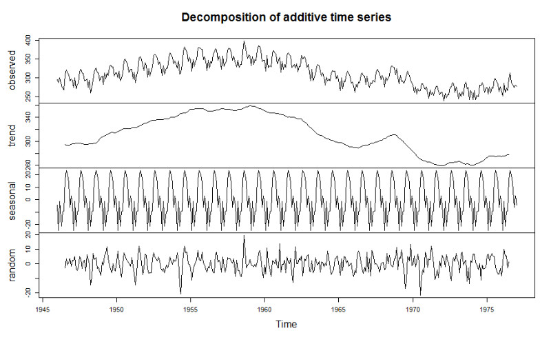
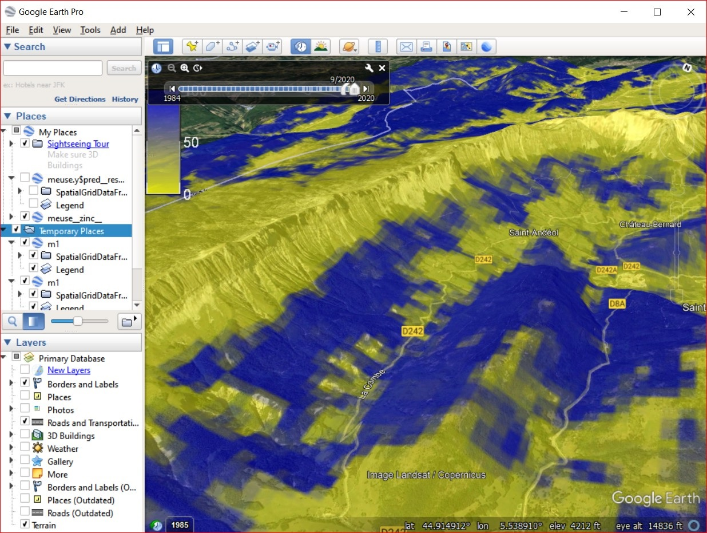

[](https://opengeohub.org)

[](http://creativecommons.org/licenses/by-sa/4.0/)

This work is licensed under a [Creative Commons Attribution-ShareAlike
4.0 International
License](http://creativecommons.org/licenses/by-sa/4.0/).

```{r, include=FALSE}
ls <- c("rgdal", "raster", "plotKML", "ranger", "mlr", "geoR", "parallelMap",
        "xgboost", "terra", "glmnet", "matrixStats", "kernlab", "deepnet", "landmap")
new.packages <- ls[!(ls %in% installed.packages()[,"Package"])]
if(length(new.packages)) install.packages(new.packages)
options(warn=-1)
if(!Sys.info()['sysname']=="Windows"){ 
  mc.cores <- parallel::detectCores() 
} else { 
  mc.cores <- 1
}
#load("eml_data.RData")
```

##  Introduction to spatiotemporal data

#### Spatiotemporal data

Spatiotemporal data is practically any data that is referenced in both space and 
time. This implies that the following *coordinates* are known:

-   geographic location (longitude and latitude or projected $X,Y$
    coordinates);
-   spatial location accuracy or size of the block / volume in the case 
    of bulking of samples;
-   height above the ground surface (elevation);
-   start and end time of measurement (year, month, day, hour, minute
    etc.);

Consider for example daily temperature measured at some meteorological station. 
This would have the following coordinates:

```{r}
temp = 22
lat = 44.56123
lon = 19.27734
delta.xy = 30
begin.time = "2013-09-02 00:00:00 CEST"
end.time = "2013-09-03 00:00:00 CEST"
```

which means that the measurement is fully spatiotemporally referenced with 
both $X,Y$ location defined, `delta.xy` location accuracy known, and begin and 
end time of measurement specified (in this case temporal support is 1 day).

Analysis of spatiotemporal data is somewhat different from pure spatial
analysis. Time is not *just another* spatial dimension i.e. it has specific properties and 
different statistical assumptions and methods apply to spatiotemporal data. For 
an introduction to spatiotemporal data in R please refer to the `spacetime` package tutorial [@pebesma2012spacetime].

Conceptually speaking, spatio-temporal data sets and corresponding 
databases can be matched with the two major groups of features [@erwig1999spatio]: (1) 
**moving or dynamic objects** (discrete or vector geometries), and (2) 
dynamic **regions** (fields or continuous features). Distinct objects (entities) 
such as people, animals, vehicles and similar are best represented using 
vectors and **trajectories** (movement through time), and fields are commonly  
represented using **gridded structures**. In the case of working with 
fields, we basically map either:

-   dynamic changes in quantity or density of some material or chemical element,
-   energy flux or any similar physical measurements,
-   dynamic changes in probability of occurrence of some feature or object,

Spatiotemporal data can be best visualized 2D+T plots **space-time cubes**. One
example of a spacetime cube is the following plot:


*Figure: Space-time cube visualized in R: (a) cloud plot showing
location of meteorological stations in Croatia [@hengl2012spatio], (b) illustration of
spatial and temporal support in the space-time cube
[@hengl2015plotkml].*

The plot above shows distribution of meteorological stations over Croatia, and 
then repeated measurements through time. This dataset is further used in the 
use-case examples to produce spatiotemporal predictions of daily temperatures.

#### Time-series analysis

Field of statistics dealing with modeling changes of variables through
time, including predicting values beyond the training data (forecasting)
is known as **time-series analysis**. Some systematic guides on how to
run time-series analysis in R can be found
[here](http://r-statistics.co/Time-Series-Analysis-With-R.html).

How a variable varies through time (time-series curves) can often be drastically different 
from how it changes in space (spatial patterns). In general, one can say that, for many 
environmental variables, variation of values through time can be separated into 
**components** such as:

-   Long-term component (**trend**) determined by long-term geological and
    extraterrestrial processes,
-   Seasonal monthly and/or daily component (**seasonality**) determined by Earth rotation and
    incoming sun radiation,
-   **Variation** component which can be due to chaotic behavior and/or
    local factors (hence *autocorrelated*), and
-   **Pure noise** i.e. measurement errors and similar,



*Figure: Illustration of decomposition of time-series into: (1) trend, (2) seasonality, and (3) random.*

Consider for example the case of the land surface temperature. The long-term 
component is determined by variations in Earth's orbit and/or Sun's 
energy output resulting in gradual drops and rises of global mean 
temperature ([glacials and interglacials](https://en.wikipedia.org/wiki/Ice_age)):


*Figure: Global temperature reconstruction from proxy data of
@Marcott1198. This shows how global temperature varies on a long-term
term scale. Graph by: Klaus Bitterman.*

Seasonal i.e. monthly and daily components of variation of land surface temperature 
are also quite systematic. They are basically determined by Earth's rotation 
and angles of Sun in relation to Earth's surface. This is a relatively stable 
pattern that looks like sinusoidal curves or similar. The plot below shows variation of values
of soil moisture and soil temperature at one meteo station in USA across multiple years
[@gasch2015spatio]:


*Figure: Sensor values from five depths (0.3, 0.6, 0.9, 1.2, and 1.5 m)
at one station at Cook Agronomy Farm from January 2011–January 2014. The
black line indicates locally fitted splines [@gasch2015spatio].*

This data set is further discussed in the case studies to demonstrate 3D+T spatiotemporal modeling.
As we will see later, the seasonal daily and monthly part of variation 
is systematic and can be modeling using latitude, altitude and time/day of the year. 

#### Visualizing spatiotemporal data

Spatial data is usually visualized using static or interactive maps (see
e.g. [mapview](https://r-spatial.github.io/mapview/) and/or [tmap
package](https://cran.r-project.org/web/packages/tmap/vignettes/tmap-getstarted.html)).
Spatiotemporal data (2D+T) is more complex to visualize than 2D data, while 3D+T data 
can even require special software [@hengl2015plotkml] before 
users can make any seamless interpretation.

There are three possible groups of ways to visualize spatiotemporal 
data:

1.  Using **static images** showing trend parameters together with 
    time-series plots at selected representative point locations.  
2.  Using **time-slices** or series of visualizations of the same 
    spatial domain but changing in time (time-lapses).  
3.  Using **animations** or **interactive plots with time-sliders**
    allowing users to choose *speed* and *direction* of animation.

For an introduction to visualizing spatiotemporal and time-series data 
refer to @lamigueiro2014displaying. More complex visualization of 
spatiotemporal / dynamic geographic features is possible by using the 
<https://geemap.org/> package (*A Python package for interactive mapping 
with Google Earth Engine, ipyleaflet, and ipywidgets*). 

OpenLandMap.org also has multiple temporal datasets and users can interactive with 
the time-dimension by using time-slider implemented in [OpenLayers and Geoserver](http://osgl.grf.bg.ac.rs/books/gvvk-en/) [@KilibardaProtic2019].


*Figure: Visualization of [land cover change using
animation](https://medium.com/nerd-for-tech/restoration-culture-what-is-land-degradation-how-to-measure-it-and-what-can-you-do-to-reverse-341e448994da)
in www.OpenLandMap.org.*

#### Spatiotemporal interpolation

Spatiotemporal interpolation and/or prediction implies that point
samples are used to interpolate within the spacetime cube. This
obviously assumes that enough point measurements are available, and which are spread in
both space and time. We will show in this tutorial how Machine Learning can 
be used to interpolate values within the spacetime cube using real case-studies. 
Spatiotemporal interpolation using various kriging methods is implemented in the [gstat package](https://cran.r-project.org/web/packages/gstat/vignettes/spatio-temporal-kriging.pdf), 
but is not addressed in this tutorial.

For success of spatiotemporal interpolation (in terms of prediction accuracy), 
the key is to recognize systematic component of variation in spacetime, which 
is usually possible if we can find relationship between the target variable and 
some EO data that is available as a time-series and covers the same spacetime cube 
of interest. Once we establish a significant relation between **dynamic target** and 
**dynamic covariates**, we can use the fitted model to predict anywhere in spacetime cube.

For more in-depth discussion on spatiotemporal data in R please refer to
@wikle2019spatio. For in-depth discussion on spatial and spatiotemporal
blocking for purpose of modeling building and cross-validation refer to
@Roberts2017. 

#### Modeling seasonal components

Seasonality is the characteristic of the target variable to follow cyclical 
patterns such as in trigonometric functions. Such repeating patterns can happen 
at different **time-scales**:

- inter-annually,
- monthly or based on a season (spring, summer, autumn, winter),
- daily,
- hourly i.e. day-time and night-time patterns,

The monthly and daily seasonal component of variation is determined by Earth's rotation
and Sun's angle. @kilibarda2014spatio have shown that the seasonal
component e.g. geometric Earth surface minimum and maximum daily temperature 
can be modeled, universally anywhere on globe, by using the following formula:

```{r}
temp.from.geom <- function(fi, day, a=30.419375, 
                b=-15.539232, elev=0, t.grad=0.6) {
  f = ifelse(fi==0, 1e-10, fi)
  costeta = cos( (day-18 )*pi/182.5 + 2^(1-sign(fi) ) *pi) 
  cosfi = cos(fi*pi/180 )
  A = cosfi
  B = (1-costeta ) * abs(sin(fi*pi/180 ) )
  x = a*A + b*B - t.grad * elev / 100
  return(x)
}
```

where `day` is the day of year, `fi` is the latitude, the number 18
represents the coldest day in the northern and warmest day in the
southern hemisphere, `elev` is the elevation in meter, 0.6 is the
vertical temperature gradient per 100-m, and `sign` denotes the
*signum* function that extracts the sign of a real number.

This formula accounts for different seasons at southern and northern 
hemisphere and can be basically applied on gridded surfaces to compute expected 
temperature at a given day. A simple example of min daily temperature is:

```{r}
temp.from.geom(fi=52, day=120)
```

If we plot this function for five consecutive years, we get something similar to the 
spline-fitted functions in the previous plot:

```{r, seasonal-plot, fig.width=8, out.width="90%", fig.cap="Geometric temperature function plot."}
days = seq(1:(5*365))
plot(temp.from.geom(fi=52, day=days))
```


## Modeling with spatial and spatiatemporal data in R

#### Standard ML steps used in predictive mapping

Standard spatiotemporal ML for predictive mapping typically includes the following steps:

1.  Prepare training (points) data and data cube with all covariates
    ideally as an analysis-ready datacube.
2.  Overlay points and create a regression-matrix.  
3.  Fine-tune initial model, reduce complexity
    and produce production-ready prediction model.  
4.  Run mapping accuracy assessment and determine prediction uncertainty
    including the per pixel uncertainty.  
5.  Generate predictions and save as maps. 
6.  Visualize predictions using web-GIS solutions.


*Figure: General Machine Learning framework recommended for predictive mapping of vegetation / ecological / soil variables. Assuming full automation of modeling, 2nd-round samples can be used to improve mapping accuracy.*

#### Extrapolation and over-fitting problems of ML methods

Machine Learning has *defacto* become next-generation applied predictive modeling 
framework. ML techniques such as **Random Forest** have proven to 
over-perform vs more simple linear statistical methods, especially where
the datasets are large, complex and target variable follows complex
relationship with covariates [@hengl2018random]. Random Forest comes at a cost 
however. There are four main practical disadvantages of RF:

-   Depending on data and assumptions about data, it can over-fit values
    without an analyst even noticing it.  
-   It predicts well only within the feature space with enough training
    data. **Extrapolation** i.e. prediction outside the training space can
    lead to poor performance [@meyerPebesma2020].  
-   It can be computationally expensive with computational load increasing
    exponentially with the number of covariates.  
-   It requires quality training data and is highly sensitive to blunders and
    typos in the data.

Read more about extrapolation problems of Random Forest in [this
post](https://medium.com/nerd-for-tech/extrapolation-is-tough-for-trees-tree-based-learners-combining-learners-of-different-type-makes-659187a6f58d).

In the following section we will demonstrate that indeed RF can overfit 
data and can have serious problems with predicting in the extrapolation 
space. Consider for example the following simple synthetic data set (see
[original post by Dylan
Beaudette](https://twitter.com/DylanBeaudette/status/1410666900581851138)):

```{r}
set.seed(200)
n = 100
x <- 1:n
y <- x + rnorm(n = 50, mean = 15, sd = 15)
```

If we fit a simple Ordinary Least Square model to this data we get:

```{r}
m0 <- lm(y ~ x)
summary(m0)
```

we see that the model explains about 85% of variation in the data and
that the RMSE estimated by the model (residual standard error) matches
very well the noise component we have inserted on purpose using the
`rnorm` function. 

If we fit a Random Forest model to this data we get:

```{r}
library(randomForest)
rf = randomForest::randomForest(data.frame(x=x), y, nodesize = 5, keep.inbag = TRUE)
rf
```

Next, we can estimate the prediction errors using the method of
@lu2021unified, which is available via the `forestError` package:

```{r}
library(forestError)
rmse <- function(a, b) {  sqrt(mean((a - b)^2)) }
dat <- data.frame(x,y)
newdata <- data.frame(
  x = -100:200
)
newdata$y.lm <- predict(m0, newdata = newdata)
## prediction error from forestError:
quantiles = c((1-.682)/2, 1-(1-.682)/2)
pr.rf = forestError::quantForestError(rf, X.train=data.frame(x=x), 
                          X.test=data.frame(x = -100:200), 
                          Y.train=y, alpha = (1-(quantiles[2]-quantiles[1])))
newdata$y.rf <- predict(rf, newdata = newdata)
rmse.lm <- round(rmse(y, predict(m0)), 1)
rmse.rf <- round(rmse(y, predict(rf)), 1)
rmse.lm; rmse.rf
```

This shows that RF estimates higher RMSE than linear model. However, if
we visualize the two models against each other we see that indeed RF
algorithm seems to over-fit this specific data:

```{r, synthetic-lm, fig.width=6, out.width="60%", fig.cap="Difference in model fits for sythetic data: lm vs RF."}
leg.txt <- sprintf("%s (%s)", c('lm', 'RF'), c(rmse.lm, rmse.rf))
par(mar = c(0, 0, 0, 0), fg = 'black', bg = 'white')
plot(y ~ x, xlim = c(-25, 125), ylim = c(-50, 150), type = 'n', axes = FALSE)
grid()
points(y ~ x, cex = 1, pch = 16, las = 1)
lines(y.lm ~ x, data = newdata, col = 2, lwd = 2)
lines(y.rf ~ x, data = newdata, col = 4, lwd = 2)
lines(newdata$x, pr.rf$estimates$lower_0.318, lty=2,col=4)
lines(newdata$x, pr.rf$estimates$upper_0.318, lty=2,col=4)
legend('bottom', legend = leg.txt, lwd = 2, lty = 1, col = c(2, 4, 3), horiz = TRUE, title = 'RMSE')
```

RF basically tries to fit relationship even to the **pure noise** component of variation 
(we know it is pure noise because we have generated it using the `rnorm` function). 
This is obvious over-fitting as we do not want to model something which is purely random.

Extrapolation would not maybe be so much of a problem in the example
above if the prediction intervals from the `forestError` package
expressed more realistically that the predictions deviate from the
*linear structure* in the data. Assuming that, after the prediction, one
would eventually collect ground-truth data for the RF model above, these
would probably show that the prediction error / prediction intervals are
completely off. Most traditional statisticians would consider these
too-narrow and over-optimistic and the fitted line over-fit, and hence
any further down the pipeline over-optimistic prediction uncertainty can
result in decision makers being over-confident, leading to wrong
decisions, and consequently making users losing any confidence in RF.
For an in-depth discussion on extrapolation problems and **Area of
Applicability** of Machine Learning models please refer to
@meyerPebesma2020.

A possible solution to the problem above is to, instead of using only
one learners, we use multiple learners and then apply robust
cross-validation that prevents the target model from over-fitting. This
can be implemented efficiently, for example, by using the `mlr` package [@bischl2016mlr]. 
We can run an Ensemble Model by applying the following
four steps. First, we define the task of interest and a combination of
learners i.e. so-called **base learners**:

```{r}
library(mlr)
library(kernlab)
library(mboost)
library(landmap)
SL.library = c("regr.ranger", "regr.glm", "regr.gamboost", "regr.ksvm")
lrns <- lapply(SL.library, mlr::makeLearner)
tsk <- mlr::makeRegrTask(data = dat, target = "y")
```

In this case we use basically four very different models: RF (`ranger`),
linear model (`glm`), Gradient boosting (`gamboost`) and Support Vector
Machine (`kvsm`). Second, we train the Ensemble model by using the stacking approach:

```{r}
init.m <- mlr::makeStackedLearner(lrns, method = "stack.cv", super.learner = "regr.lm", resampling=mlr::makeResampleDesc(method = "CV"))
eml = train(init.m, tsk)
summary(eml$learner.model$super.model$learner.model)
```

The results show that `ranger` and `ksvm` basically under-perform and are in
fact not significant for this specific data i.e. could be probably omitted from
modeling.

Note that, for **stacking** of multiple learners we use a separate model 
(a meta-learner) which is in this case a simple linear model. We use a
simple model because we assume that the non-linear relationships have
already been modeled via complex models such as `ranger`, `gamboost`
and/or `ksvm`.

Next we need to estimate mapping accuracy and **prediction errors** for
Ensemble predictions. This is not trivial as there are no simple derived formulas. 
We need to use a non-parametric approach basically and this can be very computational. 
A computationally interesting approach is to first estimate the (global) mapping 
accuracy, then adjust the prediction variance from multiple base learners:

```{r}
newdata$y.eml = predict(eml, newdata = newdata)$data$response
m.train = eml$learner.model$super.model$learner.model$model
m.terms = eml$learner.model$super.model$learner.model$terms
eml.MSE0 = matrixStats::rowSds(as.matrix(m.train[,all.vars(m.terms)[-1]]), na.rm=TRUE)^2
eml.MSE = deviance(eml$learner.model$super.model$learner.model)/df.residual(eml$learner.model$super.model$learner.model)
## correction factor / mass-preservation of MSE
eml.cf = eml.MSE/mean(eml.MSE0, na.rm = TRUE)
eml.cf
```

This shows that variance of the learners is about 10 times smaller than
the actual CV variance. Again, this proves that many learners try to fit
data very closely so that variance of different base learners is often 
smoothed out.

Next, we can predict values and prediction errors at all new locations:

```{r}
pred = mlr::getStackedBaseLearnerPredictions(eml, newdata=data.frame(x = -100:200))
rf.sd = sqrt(matrixStats::rowSds(as.matrix(as.data.frame(pred)), na.rm=TRUE)^2 * eml.cf)
rmse.eml <- round(sqrt(eml.MSE), 1)
```

and the plot the results of fitting linear model vs EML:

```{r, synthetic-eml, fig.width=6, out.width="60%", fig.cap="Difference in model fits for sythetic data: lm vs Ensemble ML."}
leg.txt <- sprintf("%s (%s)", c('lm', 'EML'), c(rmse.lm, rmse.eml))
par(mar = c(0, 0, 0, 0), fg = 'black', bg = 'white')
plot(y ~ x, xlim = c(-25, 125), ylim = c(-50, 150), type = 'n', axes = FALSE)
grid()
points(y ~ x, cex = 1, pch = 16, las = 1)
lines(y.lm ~ x, data = newdata, col = 2, lwd = 2)
lines(y.eml ~ x, data = newdata, col = 4, lwd = 2)
lines(newdata$x, newdata$y.eml+rmse.eml+rf.sd, lty=2, col=4)
lines(newdata$x, newdata$y.eml-(rmse.eml+rf.sd), lty=2, col=4)
legend('bottom', legend = leg.txt, lwd = 2, lty = 1, col = c(2, 4, 3), horiz = TRUE, title = 'RMSE')
```

From the plot above, we see that the prediction error intervals in the 
extrapolation space are now quite wide, and this reflects much better 
what we would expect than if we have only used the `forestError` package.

In summary: it appears that combining linear and non-linear tree-based
models helps both decrease over-fitting and produce more realistic
predictions of uncertainty / prediction intervals. The Ensemble ML
framework correctly identifies linear models as being more important
than random forest or similar.

#### Spatial interpolation using ML and buffer distances to points

One simple approach to interpolate values from point data using e.g.
Random Forest is to use **buffer distances** to all points as covariates. We can 
here use the meuse dataset for testing [@hengl2018random]:

```{r}
library(rgdal)
library(ranger)
library(raster)
library(plotKML)
demo(meuse, echo=FALSE)
grid.dist0 <- landmap::buffer.dist(meuse["zinc"], meuse.grid[1], as.factor(1:nrow(meuse)))
```

This creates 155 gridded maps i.e. one map per point. These maps of distances can now
be used to predict some target variable by running:

```{r}
dn0 <- paste(names(grid.dist0), collapse="+")
fm0 <- as.formula(paste("zinc ~ ", dn0))
ov.zinc <- over(meuse["zinc"], grid.dist0)
rm.zinc <- cbind(meuse@data["zinc"], ov.zinc)
m.zinc <- ranger(fm0, rm.zinc, num.trees=150, seed=1)
m.zinc
```

Using this model we can generate and plot predictions using:

```{r, map-buff, fig.width=6, out.width="70%", fig.cap="Values of Zinc predicted using only RF on buffer distances."}
op <- par(oma=c(0,0,0,1), mar=c(0,0,4,3))
zinc.rfd <- predict(m.zinc, grid.dist0@data)$predictions
meuse.grid$zinc.rfd = zinc.rfd
plot(raster(meuse.grid["zinc.rfd"]), col=R_pal[["rainbow_75"]][4:20],
         main="Predictions RF on buffer distances", axes=FALSE, box=FALSE)
points(meuse, pch="+")
par(op)
```

#### Spatial interpolation using ML and geographical distances to neighbors

Deriving buffer distances for all points is obviously not suitable for very 
large point datasets. @sekulic2020random describe an alternative, a more scalable 
method that uses closest neighbors (and their values) as covariates to predict
target variable. This can be implemented using the `meteo` package:

```{r}
library(meteo)
nearest_obs <- meteo::near.obs(locations = meuse.grid, 
                               locations.x.y = c("x","y"), 
                               observations = meuse, observations.x.y=c("x","y"), 
                               zcol = "zinc", n.obs = 10, rm.dupl = TRUE)
str(nearest_obs)
```

which produces 20 grids showing assigned values from 1st to 10th 
neighbor and distances. We can plot values based on the first neighbor, 
which corresponds to using e.g. [Voronoi polygons](https://r-spatial.github.io/sf/reference/geos_unary.html):

```{r, map-ob1, fig.width=6, out.width="70%", fig.cap="Values of first neighbor for meuse dataset."}
meuse.gridF = meuse.grid
meuse.gridF@data = nearest_obs
spplot(meuse.gridF[11])
```

Next, we can estimate the same values for training points, but this time
we remove any duplicates using `rm.dupl = TRUE`:

```{r}
## training points
nearest_obs.dev <- meteo::near.obs(locations = meuse, 
                                   locations.x.y = c("x","y"), 
                                   observations = meuse, 
                                   observations.x.y=c("x","y"), 
                                   zcol = "zinc", n.obs = 10, rm.dupl = TRUE)
meuse@data <- cbind(meuse@data, nearest_obs.dev)
```

Finally, we can fit a model to predict values purely based on spatial
autocorrelation between values (1st to 10th nearest neighbour):

```{r}
fm.RFSI <- as.formula(paste("zinc ~ ", paste(paste0("dist", 1:10), collapse="+"), "+", paste(paste0("obs", 1:10), collapse="+")))
fm.RFSI
rf_RFSI <- ranger(fm.RFSI, data=meuse@data, importance = "impurity", num.trees = 85, keep.inbag = TRUE)
rf_RFSI
```

To produce predictions we can run:

```{r, map-r, fig.width=6, out.width="70%", fig.cap="Values of first neighbor for meuse dataset."}
out = predict(rf_RFSI, meuse.gridF@data)
meuse.grid$zinc.rfsi = out$predictions
op <- par(oma=c(0,0,0,1), mar=c(0,0,4,3))
plot(raster(meuse.grid["zinc.rfsi"]), col=R_pal[["rainbow_75"]][4:20],
     main="Predictions RFSI", axes=FALSE, box=FALSE)
points(meuse, pch="+")
par(op)
#dev.off()
```

Predictions using nearest neighbors shows quite different patterns than 
predictions based on buffer distances. The method by @sekulic2020random 
is nevertheless more interesting for general applications as it could be 
also added to spatiotemporal data problems.

## Spatiotemporal Ensemble ML in R

#### Ensemble ML

**Ensemble Machine Learning** is an approach to modeling where, instead of using a 
single best learner, we use multiple **strong learners** and then combine their 
predictive capabilities into a single union. This can both lead to higher 
accuracy and robustness [@seni2010ensemble], but also helps with deriving 
model-free estimate of prediction errors. This way we can help decrease some 
methodological disadvantages of individual learners as shown in the previous 
example with synthetic data.

Ensemble Machine Learning for predictive mapping in 2D and 3D is discussed 
in detail in [this R tutorial](https://gitlab.com/openlandmap/spatial-predictions-using-eml).
In this tutorial we focus primarily on using EML for spatiotemporal data sets (2D+T, 
3D+T) as implemented using the `mlr` Machine Learning framework.

#### Case study: Daily temperatures

In previous examples we have demonstrated effects of over-fitting and 
how Ensemble ML helps decrease overfitting and extrapolation problems 
using synthetic data. We can now look at some real-life cases for example 
the daily temperatures measured for several years for Croatia described in @hengl2012spatio.
This data sets consist of two parts: (1) measurements of daily temperatures at 
meteo stations, (2) list of gridded covariates.


*Figure: Temporal dynamics of mean-daily temperatures at sample meteorological stations. 
This shows seasonality effects (smoothed line) and daily oscillations [@hengl2012spatio].*

We can load the point data by using:

```{r}
library(rgdal)
hrmeteo = readRDS("input/hrtemp2006_meteo.rds")
str(hrmeteo)
idsta.pnts = hrmeteo$stations
coordinates(idsta.pnts) = ~ X + Y
```

This is a typical format for spatiotemporal meteorological data with locations of stations in 
one table, and measurements of daily temperatures (`MDTEMP`) in other. The 
column `cday` here is the cumulative day since 1970, which allows us to present 
time on linear scale.

The gridded data includes: (a) static covariates (relief and landform data), and 
(b) dynamic time-series data (MODIS LST). 
To load the static covariates we use:

```{r}
hrgrid1km = readRDS("input/hrgrid1km.rds")
#plot(hrgrid1km[1])
proj4string(idsta.pnts) = proj4string(hrgrid1km)
str(hrgrid1km@data)
```

The dynamic time-series data is stored in a local folder (`input/LST2006HR`) as 
individual files that we can list by using:

```{r}
LST.listday <- dir("input/LST2006HR", pattern=glob2rx("LST2006_**_**.LST_Day_1km.tif"), full.names = TRUE)
LST.listnight <- dir("input/LST2006HR", pattern=glob2rx("LST2006_**_**.LST_Night_1km.tif"), full.names = TRUE)
str(LST.listday)
```

Here we see there are 46 images for year 2006 with daytime and 46 images for 
night time estimates of LST. We do not want to load all these rasters to R 
because we might experience RAM problems. We can first overlay points and see 
which variables can help with mapping daily temperatures.

For the static covariates we only have to run the overlay once:

```{r}
idsta.ov <- sp::over(idsta.pnts, hrgrid1km)
idsta.ov$IDSTA = idsta.pnts$IDSTA
str(idsta.ov)
```

For the spatiotemporal data (MODIS LST time-series) we need to run overlay as in 
a spacetime cube. This means that we need to match points using `x,y,t` 
coordinates with grids covering the same `x,y,t` fields. To speed up spacetime overlay 
we use our custom function `extract_st`, which basically builds on top of the 
`terra` package. First, we need to define begin, end times for each GeoTIFF:

```{r}
library(terra)
source("mlst_functions.R")
hrmeteo$meteo$x = plyr::join(hrmeteo$meteo, hrmeteo$stations, by="IDSTA")$X
hrmeteo$meteo$y = plyr::join(hrmeteo$meteo, hrmeteo$stations, by="IDSTA")$Y
## generate row ID:
hrmeteo$meteo$row.id = 1:nrow(hrmeteo$meteo)
hrmeteo$meteo$Date = as.Date(hrmeteo$meteo$DATE, format = "%Y-%m-%d")
## strip dates from filename:
begin.tif1.lst = as.Date(paste0("2006-", substr(basename(LST.listday), 9, 10), 
                  "-", substr(basename(LST.listday), 12, 13)))-4
end.tif1.lst = as.Date(paste0("2006-", substr(basename(LST.listday), 9, 10), 
                  "-", substr(basename(LST.listday), 12, 13)))+4
```

now that we know spacetime coordinates for both points and grids, we can run 
overlay in parallel to speed up computing:

```{r}
ov.pnts <- parallel::mclapply(1:length(LST.listday), function(i){ 
     extract_st(tif=LST.listday[i], hrmeteo$meteo, date="Date", 
                crs = proj4string(hrgrid1km),        
                date.tif.begin=begin.tif1.lst[i], 
                date.tif.end=end.tif1.lst[i], 
                coords=c("x","y"), variable.name="LST.day") }, 
     mc.cores=mc.cores)
ov.pnts = ov.pnts[!sapply(ov.pnts, is.null)]
ov.tifs1 = plyr::join_all(ov.pnts, by="row.id", type="full")
str(ov.tifs1)
ov.tifs1$LST.day = ifelse(ov.tifs1$LST.day == 0, NA, ov.tifs1$LST.day)
```

In this case we also exclude the values of `LST.day` are equal to 0 as these 
are basically missing values in the GeoTIFFs. We repeat the same overlay for night light images:

```{r}
begin.tif2.lst = as.Date(paste0("2006-", substr(basename(LST.listnight), 9, 10), 
                  "-", substr(basename(LST.listnight), 12, 13)))-4
end.tif2.lst = as.Date(paste0("2006-", substr(basename(LST.listnight), 9, 10), 
                  "-", substr(basename(LST.listnight), 12, 13)))+4
ov.pnts <- parallel::mclapply(1:length(LST.listnight), function(i){ 
     extract_st(tif=LST.listnight[i], hrmeteo$meteo, date="Date", 
                crs = proj4string(hrgrid1km),        
                date.tif.begin=begin.tif2.lst[i], 
                date.tif.end=end.tif2.lst[i], 
                coords=c("x","y"), variable.name="LST.night") }, 
     mc.cores=mc.cores)
ov.pnts = ov.pnts[!sapply(ov.pnts, is.null)]
ov.tifs2 = plyr::join_all(ov.pnts, by="row.id", type="full")
str(ov.tifs2)
ov.tifs2$LST.night = ifelse(ov.tifs2$LST.night == 0, NA, ov.tifs2$LST.night)
```

The result of spacetime overlay is a simple long table matching exactly the meteo-data table.
We next bind results of overlay using static and dynamic covariates:

```{r}
hrmeteo.rm = plyr::join_all(list(hrmeteo$meteo, ov.tifs1, ov.tifs2))
hrmeteo.rm = plyr::join(hrmeteo.rm, idsta.ov)
```

we also add the geometric component of temperature based on the sphere formulas:

```{r}
hrmeteo.rm$temp.mean <- temp.from.geom(fi=hrmeteo.rm$Lat, 
                   as.numeric(strftime(hrmeteo.rm$Date, format = "%j")), 
                   a=37.03043, b=-15.43029, elev=hrmeteo.rm$HRdem, t.grad=0.6)
```

We have now produced a **spatiotemporal regression matrix** that can be used to fit 
a prediction model for daily temperature. The model is of form:

```{r}
fm.tmp <- MDTEMP ~ temp.mean + LST.day + LST.night + HRdsea
```

We next fit an Ensemble ML using the same process described in the previous sections:

```{r}
library(mlr)
lrn.rf = mlr::makeLearner("regr.ranger", num.trees=150, importance="impurity",
                              num.threads = parallel::detectCores())
lrns.st <- list(lrn.rf, mlr::makeLearner("regr.nnet"), mlr::makeLearner("regr.gamboost"))
sel = complete.cases(hrmeteo.rm[,all.vars(fm.tmp)])
hrmeteo.rm = hrmeteo.rm[sel,]
#summary(sel)
subs <- runif(nrow(hrmeteo.rm))<.2
tsk0.st <- mlr::makeRegrTask(data = hrmeteo.rm[subs,all.vars(fm.tmp)], 
            target = "MDTEMP", blocking = as.factor(hrmeteo.rm$IDSTA[subs]))
tsk0.st
```

Train model using a subset of points:

```{r, echo=FALSE, warning=FALSE}
init.TMP <- mlr::makeStackedLearner(lrns.st, method="stack.cv", super.learner="regr.lm", 
                    resampling=mlr::makeResampleDesc(method="CV", blocking.cv=TRUE))
parallelMap::parallelStartSocket(parallel::detectCores())
eml.TMP = train(init.TMP, tsk0.st)
parallelMap::parallelStop()
```

This shows that daily temperatures can be predicted with relatively high R-square, 
although the residual values are still significant (ranging from -1.8 to 1.8 degrees):

```{r}
summary(eml.TMP$learner.model$super.model$learner.model)
```

The variable importance analysis shows that the most important variable for predicting 
daily temperatures is, in fact, the night-time MODIS LST:

```{r, var-imptemp, fig.width=5, out.width="50%", fig.cap="Variable importance for modeling spacetime daily temperatures."}
library(ggplot2)
xl <- as.data.frame(mlr::getFeatureImportance(eml.TMP[["learner.model"]][["base.models"]][[1]])$res)
xl$relative_importance = 100*xl$importance/sum(xl$importance)
xl = xl[order(xl$relative_importance, decreasing = TRUE),]
xl$variable = paste0(c(1:length(xl$variable)), ". ", xl$variable)
ggplot(data = xl[1:4,], aes(x = reorder(variable, relative_importance), y = relative_importance)) +
  geom_bar(fill = "steelblue",
           stat = "identity") +
  coord_flip() +
  labs(title = "Variable importance",
       x = NULL,
       y = NULL) +
  theme_bw() + theme(text = element_text(size=15))

```

We can use the **fitted spacetime EML model** to generate predictions e.g. for 
four consecutive days in August. First, we import MODIS LST for month of interest:

```{r}
hrpred1km = hrgrid1km
sel.tifs1 = LST.listday[grep("_08_", LST.listday)]
sel.tifs2 = LST.listnight[grep("_08_", LST.listnight)]
## read to R in parallel
x1 = as.data.frame( parallel::mclapply(sel.tifs1, 
            function(i){x <- readGDAL(i)$band1; x <- ifelse(x<1, NA, x); return(x)}, 
             mc.cores = mc.cores))
x2 = as.data.frame( parallel::mclapply(sel.tifs2, 
            function(i){x <- readGDAL(i)$band1; x <- ifelse(x<1, NA, x); return(x)}, 
             mc.cores = mc.cores))
names(x1)  <- basename(sel.tifs1); names(x2) <- basename(sel.tifs2)
```

Second, we interpolate values between 8--day periods and fill gaps in EO data 
using simple linear interpolation (MODIS images are available only every 8 days):

```{r, warning=FALSE}
dates.lst = as.Date("2006-08-13")+1:8
in.dates = c("2006-08-05", "2006-08-13", "2006-08-21", "2006-08-29")
in.days = as.numeric(strftime(as.Date(c(in.dates)), format = "%j"))
## interpolate values for missing dates in spacetime
library(parallel)
cl <- makeCluster(detectCores())
clusterExport(cl, c("in.days", "dates.lst"))
t1s = parallel::parApply(cl, x1, 1, 
      function(y) { try( approx(in.days, as.vector(y), xout=as.numeric(strftime(dates.lst, format = "%j")))$y ) })
t2s = parallel::parApply(cl, x2, 1, 
      function(y) { try( approx(in.days, as.vector(y), xout=as.numeric(strftime(dates.lst, format = "%j")))$y ) })
stopCluster(cl)
## remove missing pixels
x.t1s = parallel::mclapply(t1s, length, mc.cores = mc.cores)
t1s[which(!x.t1s==8)] <- list(rep(NA, 8))
t1s = do.call(rbind.data.frame, t1s)
names(t1s) = paste0("LST.day_", dates.lst)
x.t2s = parallel::mclapply(t2s, length, mc.cores = mc.cores)
t2s[which(!x.t2s==8)] <- list(rep(NA, 8))
t2s = do.call(rbind.data.frame, t2s)
names(t2s) = paste0("LST.night_", dates.lst)
```

Now we can make predictions for the target days in August 2006 by using (we run 
this operation in a loop to avoid RAM overload):

```{r, warning=FALSE}
for(j in paste(dates.lst)){
  out.tif = paste0("output/MDTEMP_", j, ".tif")
  if(!file.exists(out.tif)){
    hrpred1km@data[,"LST.day"] = t1s[,paste0("LST.day_", j)]
    hrpred1km@data[,"LST.night"] = t2s[,paste0("LST.night_", j)]
    hrpred1km$temp.mean = temp.from.geom(fi=hrpred1km$Lat, 
                     as.numeric(strftime(as.Date(j), format = "%j")), 
                     a=37.03043, b=-15.43029, elev=hrpred1km$HRdem, t.grad=0.6)
    sel.pix = complete.cases(hrpred1km@data[,eml.TMP$features])
    out = predict(eml.TMP, newdata=hrpred1km@data[sel.pix,eml.TMP$features])
    hrpred1km@data[,paste0("MDTEMP_", j)] = NA
    hrpred1km@data[sel.pix, make.names(paste0("MDTEMP_", j))] = out$data$response * 10
    writeGDAL(hrpred1km[make.names(paste0("MDTEMP_", j))], out.tif, mvFlag = -32768,
              type = "Int16", options = c("COMPRESS=DEFLATE"))
  } else {
    hrpred1km@data[,make.names(paste0("MDTEMP_", j))] = readGDAL(out.tif)$band1
  }
}
```

To plot these predictions we can either put predictions in the `spacetime` package 
class (see [gstat tutorial](https://cran.r-project.org/web/packages/gstat/vignettes/spatio-temporal-kriging.pdf)), or simply plot them using `sp` package:

```{r, st-plottemp, fig.width=8, out.width="90%", fig.cap="Predictions spacetime daily temperature for August 2006."}
st.pts = list("sp.points", idsta.pnts, pch = "+", col="black")
spplot(hrpred1km[make.names(paste0("MDTEMP_", dates.lst[c(1,4,8)]))], 
      col.regions=R_pal[["rainbow_75"]][4:20],
      at = seq(143, 239, length.out=17),
      sp.layout = list(st.pts),
      main="Prediction daily temperature")
#dev.off()
```

In summary, this example shows how to fit spatiotemporal EML with using 
also seasonality component together with the EO data. It can hence 
be considered a *complete framework* for spatiotemporal interpolation as both static, 
dynamic covariates and latitude / elevation are used for model training.

#### Case study: Cookfarm dataset

We next look at the **Cookfarm dataset**, which is available via the landmap
package:

```{r}
library(landmap)
#?landmap::cookfarm
data("cookfarm")
```

This dataset contains spatio-temporal (3D+T) measurements of three soil
properties and a number of spatial and temporal regression covariates.
It is described in detail in @gasch2015spatio. In this example we fit a
spatiotemporal model to predict soil moisture, soil temperature and
electrical conductivity in 3D+T (hence 1 extra dimension).

We can load the prediction locations and regression-matrix from:

```{r}
library(rgdal)
library(ranger)
cookfarm.rm = readRDS('input/cookfarm_st.rds')
cookfarm.grid = readRDS('input/cookfarm_grid10m.rds')
```

We are interested in modeling soil moisture (`VW`) as a function of soil
depth (`altitude`), elevation (`DEM`), Topographic Wetness Index
(`TWI`), Normalized Difference Red Edge Index (`NDRE.M`), Normalized
Difference Red Edge Index (`NDRE.sd`), Cumulative precipitation in mm
(`Precip_cum`), Maximum measured temperature (`MaxT_wrcc`), Minimum
measured temperature (`MinT_wrcc`) and the transformed cumulative day
(`cdayt`):

```{r}
fm <- VW ~ altitude+DEM+TWI+NDRE.M+NDRE.Sd+Precip_cum+MaxT_wrcc+MinT_wrcc+cdayt
```

We can use the ranger package to fit a random forest model:

```{r}
m.vw = ranger(fm, cookfarm.rm, num.trees = 100)
m.vw
```

which shows that a significant model can be fitting using this data with
R-square above 0.80. This model, however, as shown in @gasch2015spatio
unfortunately ignores the fact that many `VW` measurements have exactly
the same location (monitoring station with four depths), hence ranger over-fits 
data and gives unrealistic R-square.

We can now fit an Ensemble ML model, but we will also use a **blocking
parameter** that should protect from over-fitting: the unique code of
the station (`SOURCEID`). This means that **complete stations** will be
either used for training or for validation. This satisfies the
requirement of @Roberts2017 for predicting to new data or predictor
space.

We use the same procedure in `mlr` as in the previous example:

```{r}
library(mlr)
SL.lst = c("regr.ranger", "regr.gamboost", "regr.cvglmnet")
lrns.st <- lapply(SL.lst, mlr::makeLearner)
## subset to 5% to speed up computing
subs <- runif(nrow(cookfarm.rm))<.05
tsk.st <- mlr::makeRegrTask(data = cookfarm.rm[subs, all.vars(fm)], target = "VW", 
            blocking = as.factor(cookfarm.rm$SOURCEID)[subs])
tsk.st
```

The resulting model again used simple linear regression for stacking
various learners:

```{r, echo=FALSE}
init.VW <- mlr::makeStackedLearner(lrns.st, method = "stack.cv", super.learner = "regr.lm", 
                    resampling=mlr::makeResampleDesc(method = "CV", blocking.cv=TRUE))
parallelMap::parallelStartSocket(parallel::detectCores())
eml.VW = train(init.VW, tsk.st)
parallelMap::parallelStop()
```

Note that here we can use full-parallelisation to speed up computing by
using the `parallelMap` package. This resulting EML model now shows a
more realistic R-square / RMSE:

```{r}
summary(eml.VW$learner.model$super.model$learner.model)
```

This is now a 3D+T model of `VW`, which means that we can use it to
predict values of `VW` at any new `x,y,d,t` location. To make prediction
for a specific *slice* we use:

```{r, echo=FALSE}
cookfarm$weather$Precip_cum <- ave(cookfarm$weather$Precip_wrcc,
   rev(cumsum(rev(cookfarm$weather$Precip_wrcc)==0)), FUN=cumsum)
date = as.Date("2012-07-30")
cday = floor(unclass(date)/86400-.5)
cdayt = cos((cday-min(cookfarm.rm$cday))*pi/180)
depth = -0.3
new.st <- data.frame(cookfarm.grid)
new.st$Date = date
new.st$cdayt = cdayt
new.st$altitude = depth
new.st = plyr::join(new.st, cookfarm$weather, type="left")
## predict:
pr.df = predict(eml.VW, newdata = new.st[,all.vars(fm)[-1]])
```

To plot prediction together with locations of training points we can
use:

```{r, map-vw, fig.width=6, out.width="70%", fig.cap="Predicted soil water content based on spatiotemporal EML."}
cookfarm.grid$pr.VW = pr.df$data$response
plot(raster::raster(cookfarm.grid["pr.VW"]), col=rev(bpy.colors()),
    main="Predicted VW for 2012-07-30 and depth -0.3 m", axes=FALSE, box=FALSE)
points(cookfarm$profiles[,c("Easting","Northing")], pch="+")
```

We could also predict values of `VW` for longer periods (e.g. 100 days) then
visualize changes using e.g. the `animation` package or similar.

#### Case study: Spatiotemporal distribution of Fagus sylvatica

In the next example we show how to fit a spatiotemporal model
using biological data: occurrences of [*Fagus
sylvatica*](https://www.gbif.org/species/2882316) over Europe. This is
the domain of **Species Distribution modeling**, except in this case we
model distribution of target species also in spacetime. The training (point) data has
been compiled for the purpose of the OpenDataScience.eu project, then
cleaned and overlaid vs time-series of Landsat GLAD images and climatic
variables [@witjes2021spatiotemporal]. For more details about the data refer 
to the [eumap repository](https://gitlab.com/geoharmonizer_inea/eumap).

We can load a snapshot of data by using:

```{r}
library(data.table)
library(mlr)
library(sp)
fs.rm = readRDS('input/fagus_sylvatica_st.rds')
occ.pnts = fs.rm[,c("Atlas_class","easting","northing")]
coordinates(occ.pnts) = ~ easting + northing
proj4string(occ.pnts) = "+init=epsg:3035"
occ.pnts = spTransform(occ.pnts, CRS("+init=epsg:4326"))
```

This is a subset of a [larger
dataset](https://gitlab.com/openlandmap/eu-forest-tree-point-data) that
has been used to produce predictions of distribution of key forest tree
species for Europe (you can browse the data via <https://maps.opendatascience.eu>). 
The first columns of this dataset show:

```{r}
head(fs.rm[,1:10])
```

The header columns are:

-   `id`: is the unique ID of each point;  
-   `year`: is the year of obsevation;
-   `postprocess`: column can have value yearly or spacetime to identify
    if the temporal reference of an observation comes from the original
    dataset or is the result of post-processing (yearly for originals,
    spacetime for post-processed points);  
-   `Tile_ID`: is as extracted from the 30-km tiling system;  
-   `easting`: is the easting coordinate of the observation point;
-   `northing`: is the northing coordinate of the observation point;
-   `Atlas_class`: contains name of the tree species or NULL if it's an
    absence point coming from LUCAS;
-   `lc1`: contains original LUCAS land cover classes or NULL if it's a
    presence point;

Other columns are the EO and ecological covariates that we use for
modeling distribution of [*Fagus
sylvatica*](https://www.gbif.org/species/2882316). We can plot distribution of
points over EU using:

```{r, map-fs, fig.width=8, out.width="80%", fig.cap="Distribution of occurrence locations for Fagus Sylvatica."}
library(rnaturalearth)
library(raster)
europe <- rnaturalearth::ne_countries(scale=10, continent = 'europe')
europe <- raster::crop(europe, extent(-24.8,35.2,31,68.5))
op = par(mar=c(0,0,0,0))
plot(europe, col="lightgrey", border="darkgrey", axes=FALSE)
points(occ.pnts[occ.pnts$Atlas_class==1,], pch="+", cex=.8)
par(op)
#dev.off()
```

As in previous examples, we first define the target model formula. We
remove from model all other columns that are not used for prediction:

```{r}
covs = grep("id|year|postprocess|Tile_ID|easting|northing|Atlas_class|lc1", 
          colnames(fs.rm), value = TRUE, invert = TRUE)
fm.fs = stats::as.formula(paste("Atlas_class ~ ", paste(covs, collapse="+")))
fs.rm$Atlas_class = factor(fs.rm$Atlas_class)
all.vars(fm.fs)[1:5]
```

To speed-up fitting of the models we have prepared a function that wraps all modeling steps:

```{r, echo=FALSE}
source("mlst_functions.R")
fs.rm0 = fs.rm[runif(nrow(fs.rm))<.2,]
eml.fs = train_sp_eml(data = fs.rm0, formula = fm.fs, blocking = as.factor(fs.rm$Tile_ID))
```

This fits an ensemble model of binary classification models 
(`classif.ranger`, `classif.xgboost`, `classif.glmnet`) and which basically can 
be used to predict probability of any training point being classified `0`
(not-occurring) or `1` (occurring).

The intermediate models (fine-tuned RF and XGboost) are written to local
folder `output` as RDS files. For meta-learner we use a GLM model with binomial link
function:

```{r}
#eml.fs = readRDS("output/EML_model.rds")
summary(eml.fs$learner.model$super.model$learner.model)
```

The variable importance analysis (RF component) shows that the most
important covariates for mapping distribution of Fagus sylvatica are
landsat images (which is expected):

```{r}
library(ggplot2)
xl <- as.data.frame(mlr::getFeatureImportance(eml.fs[["learner.model"]][["base.models"]][[1]])$res)
xl$relative_importance = 100*xl$importance/sum(xl$importance)
xl = xl[order(xl$relative_importance, decreasing = T),]
xl$variable = paste0(c(1:182), ". ", xl$variable)
ggplot(data = xl[1:20,], aes(x = reorder(variable, relative_importance), y = relative_importance)) +
  geom_bar(fill = "steelblue",
           stat = "identity") +
  coord_flip() +
  labs(title = "Variable importance",
       x = NULL,
       y = NULL) +
  theme_bw() + theme(text = element_text(size=15))
```

To produce spacetime predictions for some tiles (120-m spatial
resolution) we can run:

```{r, echo=FALSE}
m1 = predict_tiles(input = "9690.2015",  model = eml.fs)
m2 = predict_tiles(input = "9690.2017",  model = eml.fs)
m3 = predict_tiles(input = "9690.2019",  model = eml.fs)
m1$Prob.2015 = m1$Prob
m1$Prob.2017 = m2$Prob
m1$Prob.2019 = m3$Prob
```

We can compare predictions of the probability of occurrence of the
target species for two years next to each other by using:

```{r, predictions-fs, fig.width=8, out.width="90%", fig.cap="Predicted probability of occurrence for Fagus Sylvatica for 3 periods."}
pts = list("sp.points", spTransform(occ.pnts[occ.pnts$Atlas_class==1,], CRS("+init=epsg:3035")), 
           pch = "+", col="black")
spplot(m1[,c("Prob.2015","Prob.2017","Prob.2019")], col.regions=rev(bpy.colors()),
  sp.layout = list(pts),
  main="Predictions Fagus Sylvatica")
#dev.off()
```

In this case there seems to be no drastic changes in the distribution of
the target species, which is also expected because forest species distribution
change on a scale of 50 to 100 year and not on a scale of few years. 
Some changes in distribution of the species, however, can be detected nevertheless. 
These can be due to abrupt events such as pest-pandemics, fires, floods or landslides 
or clear cutting of forests of course.

We can also plot the images using the `plotKML` package so that we can open and 
visualize predictions also in Google Earth or similar:

```{r, eval=FALSE}
library(plotKML)
for(j in c(2015,2017,2019)){
  kml(m1, colour=m1@data[,paste0("Prob.", j)], file.name=paste0("prob.", j, ".kml"),
      raster_name = paste0("prob.", j, ".png"),
      colour_scale = SAGA_pal[["SG_COLORS_YELLOW_BLUE"]], 
      z.lim=c(0,100),
      TimeSpan.begin = as.Date(paste0(j, "-01-01")), TimeSpan.end = as.Date(paste0(j, "-12-31")))
}
```

In this case we attach to each prediction also the `TimeSpan.begin` and `TimeSpan.end` 
which means that Google Earth will recognize the temporal reference of the predictions. 
Opening predictions in Google Earth allows us to do some interpretation of produced maps and also 
analyze how much are the changes in vegetation cover connected with relief, 
proximity to urban areas, possible fire / flood events and similar.



*Figure: Spacetime predictions of distribution of Fagus Sylvatica visualized as time-series data in Google Earth.*


## Summary notes

In this tutorial we have reviewed some aspects of spatial and
spatiotemporal data and demonstrated how to use ML, specifically
Ensemble ML, to train spatiotemporal models and produce time-series of
predictions. We have also shown, using some synthetic and real-life datasets, how
incorrectly setting up training and cross-validation can lead to
over-fitting problems. This was done to help users realize that Machine Learning, 
however trivial it might seem, is not a click-a-button process and solid knowledge 
and understanding of advanced statistics (regression, hypothesis testing, 
sampling and resampling, probability theory) is still required.

For spatiotemporal models, we recommend combining covariates that 
can represent both long-term or accumulated effects of climate, together with 
covariates that can represent daily to monthly oscillation of variables such as soil
moisture, temperatures and similar. During the design of the modeling system, 
we highly recommend **trying to understand ecology and processes behind 
variable of interest** first, then designing the modeling system to best reflect expert 
knowledge. The example with RF over-fitting data in @gasch2015spatio shows how in-depth 
understanding of the problem can help design modeling framework and prevent 
from over-fitting problems and similar.

Where time-series EO data exists, these can be also incorporated into the 
mapping algorithm as shown with three case studies. For spacetime overlays we 
recommend using Cloud-Optimized GeoTIFFs and the `terra` package [@hijmans2019spatial] which helps speed-up overlays. Other options for efficient overlay are the `stars` and `gdalcubes` package [@appel2019demand].

Spatiotemporal datasets can be at the order of magnitude larger, hence
it is important, when implementing analysis of spatiotemporal data, to
consider **computing optimization**, which typically implies:

-   Running operations in parallel;
-   Separating fine-tuning and parameter optimization (best to run on
    subset and save computing time) from predictions,
-   Using tiling systems to run overlay, predictions and visualizations,

Finally, we recommend following these generic steps to fit spatiotemporal models:

0.  Define target of interest and design the modeling framework by understanding 
    ecology and processes behind variable of interest.  
1.  Prepare training (points) data and a data cube with all covariates
    referenced in spacetime.  
2.  Overlay points in spacetime, create a spatiotemporal
    regression-matrix.  
3.  Add seasonal components, fine-tune initial model, reduce complexity
    as much as possible, and produce production-ready spatiotemporal prediction model
    (usually using Ensemble Machine Learning).  
4.  Run mapping accuracy assessment and determine prediction uncertainty
    including the per pixel uncertainty.  
5.  Generate predictions in spacetime — create time-series of
    predictions.  
6.  (optional) Run change-detection / trend analysis and try to detect
    main drivers of positive / negative trends [@witjes2021spatiotemporal].  
7.  Deploy predictions as Cloud-Optimized GeoTIFF and produce the final
    report with mapping accuracy, variable importance.  

Ensemble ML framework we used here clearly offers many benefits, but it also comes 
at a cost of at the order of magnitude higher computational load. Also 
interpretation of such models can be a cumbersome as there a multiple 
learners plus a meta-learner, so it often becomes difficult to 
track-back individual relationship between variables. To help increase 
confidence in the produced models, we recommend studying the [Interpretable Machine
Learning](https://christophm.github.io/interpretable-ml-book/) methods
[@molnar2020interpretable], running additional model diagnostics, and
intensively plotting data in space and spacetime and feature space.

Note that the `mlr` package is discontinued, so some of the examples 
above might become unstable with time. You are advised instead to use
the new [mlr3 package](https://mlr3.mlr-org.com/).

```{r, include=FALSE}
rm(m.vw)
gc()
save.image("eml_data.RData")
#rmarkdown::render("README.rmd")
```

## References
