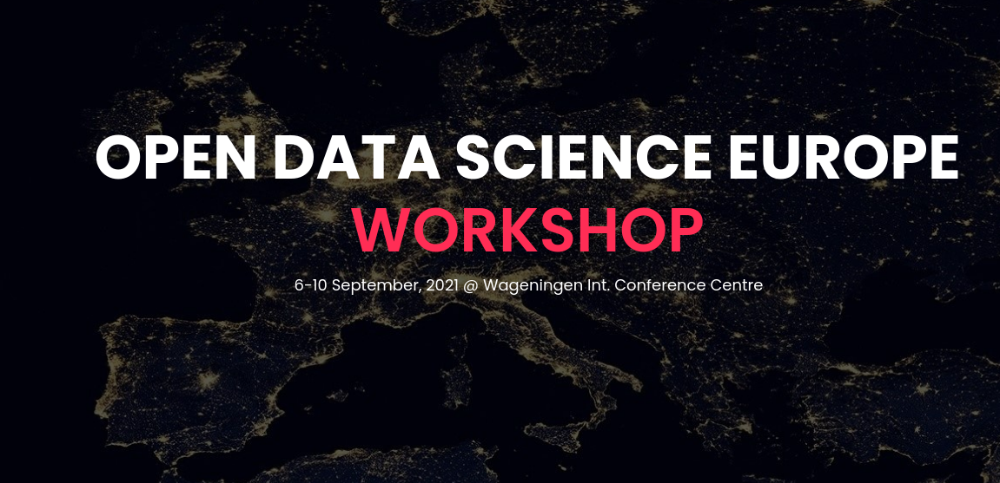

# ODSE Workshop 2021



Repository to provide access to the codes/scripts used during the [training sessions](https://opendatascience.eu/workshop-2021/timeline-and-instructions/) of [ODSE Workshop 2021](https://opendatascience.eu/workshop-2021/).

To download it for the first time:

```bash
git clone https://gitlab.com/geoharmonizer_inea/odse-workshop-2021.git
```

To update your local version:

```bash
git pull https://gitlab.com/geoharmonizer_inea/odse-workshop-2021.git
```

**Access our [preparation tutorial](../../wikis/Training-session-preparation)** to get a ready-to-use environment with all the softwares and libraries used during the training.